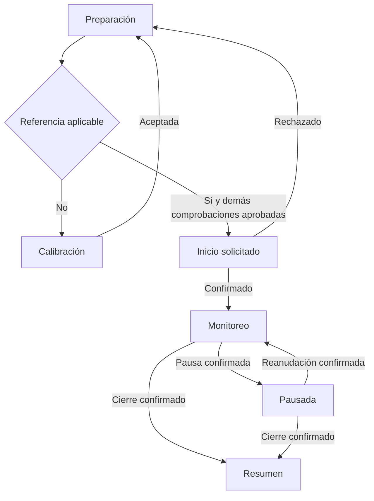

# Vigía · Área 02: experiencia de usuario, flujos y navegación

**Versión:** 1.0  
**Autor del proyecto:** Juan José Rueda Viveros  
**Documento de referencia:** PRD de Vigía v1.1  
**Estado:** especificación propuesta, pendiente de prototipo y pruebas.

## 1. Alcance de esta área

Esta especificación define cómo se organiza la aplicación, qué información muestra cada pantalla, qué acciones permite y cómo responde ante confirmaciones, cancelaciones, errores e incertidumbre.

No contiene código ni diseño visual definitivo. Los wireframes se desarrollarán en el Área 03 y el design system después de ellos.

Identificadores utilizados:

| Prefijo | Significado |
|---|---|
| P | Pantalla |
| D | Diálogo |
| FL | Flujo de uso |
| ER | Excepción |
| UX | Requisito de experiencia |
| CA | Criterio de aceptación |
| UT | Tarea de evaluación con usuarios |

Una pulsación no demuestra que una operación terminó. Inicio, pausa, reanudación, cierre, guardado, exportación y eliminación requieren confirmación antes de comunicar éxito.

Los parámetros **Q, Kcal, W, C, Tclose, Eend, Rrepeat, Tstale y Krecover** conservan sus dependencias pendientes del PRD. Esta área especifica cómo representar sus resultados; no inventa sus valores.

Las pruebas de navegación y comprensión no validan la detección de somnolencia.

## 2. Arquitectura de información

### 2.1 Navegación principal

La aplicación tendrá tres secciones, en este orden:

| Sección | Contenido | Acción principal |
|---|---|---|
| Inicio | Preparación, sesión vigente, recuperación y último resumen | Preparar sesión o volver al monitoreo |
| Historial | Sesiones, detalles, episodios y tendencias | Abrir una sesión |
| Ajustes | Apariencia, sonido, datos, perfil opcional y ayuda | Abrir la opción seleccionada |

**Tendencias estará dentro de Historial.** No tendrá una cuarta pestaña.

No se necesita cuenta ni alias para preparar una sesión.

Cada sección conserva su posición de lista durante la misma ejecución. Pulsar la pestaña ya seleccionada no crea otra copia de su pantalla raíz.

### 2.2 Recorrido dedicado de monitoreo

Preparación, calibración y monitoreo no muestran la barra principal.

Una referencia aplicable no sustituye las demás comprobaciones. Antes de iniciar se verifican permiso, cámara, modelo, calidad ocular, referencia y prueba de sonido.

Monitoreo y pausa son variantes de una misma pantalla y conservan el mismo identificador de sesión.

### 2.3 Apertura y retorno a la aplicación

Antes de ofrecer otro inicio, la interfaz consulta el estado del motor y los registros recuperables.

| Resultado de la consulta | Comportamiento |
|---|---|
| Sesión vigente con estado confirmado | Abre Monitoreo del mismo ID, activa o pausada |
| Proceso anterior terminado sin cierre confirmado | Muestra Sesión interrumpida y permite revisar registros |
| Estado todavía desconocido | Muestra Estado del monitoreo no disponible y bloquea otro inicio |
| Sin sesión vigente, explicación pendiente | Abre Bienvenida |
| Sin sesión vigente, explicación ya vista | Abre Inicio |

Durante la consulta no se presenta el monitoreo como activo.

Una desconexión de la interfaz no se interpreta automáticamente como muerte del proceso. Esa distinción requiere evidencia del motor.

## 3. Inventario de pantallas

Las variantes de carga, error y éxito no son pantallas adicionales.

| ID | Pantalla | Información obligatoria | Acciones |
|---|---|---|---|
| P01 | Bienvenida y procesamiento | Finalidad, condiciones, procesamiento local y datos guardados | Continuar |
| P02 | Permiso de cámara | Motivo del permiso, estado y consecuencia del rechazo | Permitir cámara, Ahora no, Abrir ajustes cuando corresponda |
| P03 | Inicio | Preparación, sesión vigente o recuperación y último resumen | Preparar sesión, Volver al monitoreo, Ver último resumen, Revisar registro |
| P04 | Preparación | Soporte, preview, permiso, cámara, modelo, rostro, ojos, referencia y sonido | Cambié la posición, Calibrar, Probar sonido, Lo escuché, Iniciar monitoreo |
| P05 | Calibración | Instrucciones, adquisición, calidad y resultado | Comenzar, Cancelar, Reintentar, Usar referencia aceptada |
| P06 | Monitoreo y pausa | Estado de sesión, medición, señal, duración y operación pendiente | Pausar, Reanudar, Finalizar, Consultar estado |
| P07 | Resumen | Estado de registro, tiempos, cobertura, episodios, pausas y extremos desconocidos | Ver detalle, Volver al inicio |
| P08 | Historial | Sesiones ordenadas por inicio, estado y cobertura | Seleccionar sesión, Ver tendencias, Preparar primera sesión |
| P09 | Detalle de sesión | Identificador, inicio/final, tiempos, cobertura, línea temporal y versiones | Abrir episodio, Exportar sesión, Eliminar sesión |
| P10 | Detalle de episodio | Categoría, motivo, fecha, desplazamiento, duración, calidad, versiones y valoración | Elegir valoración, Guardar valoración |
| P11 | Tendencias | Periodo, fechas exactas, grupos de política, tiempos, episodios, tasas y pausas | Cambiar entre 7 y 30 días |
| P12 | Ajustes | Tema y entradas a sonido, datos, perfil y ayuda | Elegir tema, abrir una opción |
| P13 | Sonido | Patrones incluidos, selección y resultado de prueba | Seleccionar, Probar, Guardar |
| P14 | Datos | Retención, corte, limpieza y alcance de eliminación | Cambiar retención, Exportar todo, Borrar todo |
| P15 | Exportación | Alcance, formato, contenido y archivos previstos | Elegir formato, Exportar, Cancelar, Reintentar pendientes |
| P16 | Temas de ayuda | Seis temas del PRD y explicación del producto | Seleccionar tema |
| P17 | Artículo de ayuda | Causa, pasos y condición para reintentar | Volver, Abrir ajustes o Volver a preparación |
| P18 | Perfil local opcional | Alias y explicación de uso personal | Guardar alias, Quitar alias |

### Restricciones de las pantallas

- P01 no solicita cámara ni comienza captura.
- P02 no crea una sesión.
- P04 mantiene el inicio bloqueado si falta una comprobación.
- P05 no cuenta como tiempo de sesión.
- P06 no contiene gráficos, cuestionarios, valoración de alertas, exportación ni edición de umbrales.
- P07 distingue resumen completo, pendiente e incompleto.
- P09–P11 no se abren mientras exista una sesión vigente.
- P13–P18 quedan bloqueadas durante una sesión vigente. En P12 solo se permite cambiar tema.
- P17 no activa captura por el hecho de abrirlo.
- P18 es opcional y no identifica automáticamente al conductor.

**Decisión propuesta para el alias:** entre 0 y 40 caracteres Unicode, sin espacios al principio o al final. Vacío significa sin alias. Si excede 40, se muestra “Usa hasta 40 caracteres” y no se guarda. Su validación técnica se concretará en el contrato de datos.

### 3.1 Diálogos

| ID | Disparador | Contenido y acciones | Resultado |
|---|---|---|---|
| D01 | Salir de preparación iniciada | “Se cerrará la cámara. Todavía no hay una sesión.” Seguir preparando / Salir | Salir libera captura y vuelve a Inicio |
| D02 | Finalizar sesión | “Se detendrá el monitoreo.” Continuar sesión / Finalizar | Confirmar solicita cierre |
| D03 | Eliminar una sesión | Fecha, ID y datos asociados; aviso sobre copias externas. Cancelar / Eliminar | Éxito confirmado vuelve a Historial |
| D04 | Reducir retención | Nuevo plazo, fecha de corte y cantidad afectada. Cancelar / Aplicar y eliminar | Aplica el alcance confirmado |
| D05 | Volver desde monitoreo | “La sesión continuará si el motor mantiene la medición.” Seguir aquí / Volver al inicio | Navega sin pausar ni cerrar |
| D06 | Recuperar sesión interrumpida | “No hay cierre confirmado.” Revisar registro / Ir al inicio | No reinicia cámara |
| D07 | Borrar todos los datos | Incluye historial, eventos, referencias y alias; copias externas permanecen. Cancelar / Borrar todo | Éxito vuelve a Inicio sin esos datos |
| D08 | Exportación CSV parcial | Estado individual de los dos archivos. Volver / Reintentar archivos pendientes | No declara exportación completa |

Volver en una confirmación equivale a cancelar antes de comenzar la operación.

Una eliminación ya iniciada no se cancela por cerrar el diálogo. Su estado se recupera al volver a la aplicación.

## 4. Navegación y acciones permitidas

### 4.1 Comportamiento de Volver

| Contexto | Resultado |
|---|---|
| Raíz Historial o Ajustes, sin sesión | Vuelve a Inicio |
| Inicio, sin sesión | Permite salida mediante Android |
| Preparación con preview o prueba iniciada | Abre D01 |
| Preparación todavía no iniciada | Vuelve directamente a Inicio |
| Calibración adquiriendo referencia | Detiene adquisición y vuelve a Preparación |
| Monitoreo activo o pausado | Abre D05 |
| Inicio, pausa, reanudación o cierre pendientes | Permanece en Monitoreo con Operación en curso |
| Resumen | Vuelve a Inicio; no reconstruye el monitoreo cerrado |
| Detalle de episodio | Vuelve al detalle de su sesión |
| Tendencias | Vuelve a Historial |
| Sonido, Datos, Perfil o Temas de ayuda | Vuelve a su origen |
| Selector de archivos Android | Regresa a Exportación y comunica cancelación |

En Sonido, Perfil o Valoración, salir con cambios sin guardar ofrece **Descartar cambios / Seguir editando**.

### 4.2 Restricciones durante sesión vigente

“Sesión vigente” incluye activa, pausada y sus transiciones, hasta confirmar cierre. Si el estado es incierto se aplican las mismas restricciones.

| Función | Activa | Pausada |
|---|---|---|
| Volver entre Monitoreo e Inicio | Permitido; conserva ID | Permitido; conserva ID |
| Pausar | Permitido si no hay orden pendiente | No disponible |
| Reanudar | No disponible | Solicitable con comprobaciones |
| Finalizar | Permitido | Permitido |
| Iniciar otra sesión o recalibrar | Bloqueado | Bloqueado |
| Abrir lista de Historial/Ajustes desde Inicio | Permitido con restricciones | Igual |
| Detalle, tendencias, valoración, exportación, borrado, retención, alias y tutorial | Bloqueados | Bloqueados |
| Cambiar tema | Permitido | Permitido |

Las rutas directas también deben aplicar estos bloqueos. Ocultar un botón no basta.

La aplicación no determina si el vehículo está detenido. Los controles presentan ese recordatorio sin tratarlo como verificación de velocidad.

## 5. Estados visibles y confirmaciones

### 5.1 Tres estados separados

| Eje | Valores |
|---|---|
| Sesión | Preparando, Iniciando, Activa, Pausada, Finalizando, Finalizada, Interrumpida |
| Medición | Inicializando, Utilizable, Limitada, No disponible |
| Señales | Sin señales persistentes, Advertencia, Alerta por cierre prolongado, No evaluable |

**Pausando** y **Reanudando** describen solicitudes pendientes. No confirman el estado del motor.

En Pausada se muestra “Monitoreo pausado” y “Evaluación suspendida”. La última señal no se presenta como observación actual.

Una medición Limitada solo permite evaluación si el motor confirma que la política todavía puede operar. Sin esa confirmación se muestra No evaluable.

### 5.2 Mensajes durante monitoreo

| Situación | Mensaje principal | Información secundaria |
|---|---|---|
| Medición válida, sin regla persistente | Monitoreo activo | Sin señales persistentes |
| Advertencia W | Señales persistentes | Planifica una pausa en un lugar seguro |
| Cierre C durante Tclose | Cierre ocular prolongado | Detente en un lugar seguro |
| Calidad inválida | No puedo evaluar | Causa emitida por el motor |
| Recuperación incompleta | Recuperando medición | Aún no puedo evaluar |
| Desconexión UI–motor | Estado del monitoreo no disponible | Consultando el estado de la sesión |
| Pausa confirmada | Monitoreo pausado | Evaluación suspendida |

No se usa “Seguro”, “Puedes conducir” ni un porcentaje de fatiga sin fundamento.

Una alerta no exige pulsar Entendido, responder preguntas o abrir otra pantalla.

### 5.3 Órdenes pendientes

**Decisión UX propuesta:** después de 5 segundos sin resolución, se muestra **Confirmación pendiente** y se consulta el estado.

Ese límite no demuestra que la operación fracasó. Tampoco es un umbral de detección.

| Orden | Antes de confirmar | Confirmación | Rechazo |
|---|---|---|---|
| Iniciar | Iniciando; bloquea otro inicio | Activa, ID único | Preparación y causa |
| Pausar | Pausando | Pausada e intervalo abierto | Estado confirmado y motivo |
| Reanudar | Reanudando; pausa sigue abierta | Activa, mismo ID | Pausada y causa |
| Finalizar | Finalizando | Resumen | Estado confirmado; no simula cierre |

Consultar estado no crea otra orden. La respuesta tardía se reconcilia usando el mismo identificador.

### 5.4 Precedencia de avisos

- Una alerta ocular actual tiene precedencia sobre una advertencia actual.
- Si se pierde calidad, No puedo evaluar reemplaza la señal actual. El episodio anterior permanece como registro histórico.
- Un error de guardado aparece como información secundaria y no tapa una alerta.
- Con desconexión no se presentan señales nuevas supuestas.
- Los tiempos de repetición y cierre dependen de Rrepeat y Eend; esta área no los reemplaza por valores arbitrarios.

## 6. Flujos de uso

### FL01 · Primera apertura y permiso

**Entrada:** explicación no vista y ninguna sesión vigente.  
**PRD:** RF01, RF02.

1. Bienvenida presenta propósito y datos antes de solicitar permiso.
2. Continuar guarda la versión vista y abre Permiso de cámara.
3. Permitir cámara invoca una solicitud Android.
4. Aceptación comprobada abre Preparación; no inicia una sesión.
5. Rechazo conserva “Cámara sin permiso”. Ahora no abre Inicio sin captura.
6. Si no puede repetirse la solicitud, se ofrece Abrir ajustes.
7. Al volver se consulta el permiso. Si continúa denegado, el bloqueo permanece.

**Salida:** preparación disponible o uso de Inicio sin cámara.

### FL02 · Preparación habitual

**Entrada:** sin sesión vigente ni inicio incierto.  
**PRD:** RF03–RF05, RF07–RF09.

1. Inicio → Preparar sesión → Preparación.
2. Se recuerda preparar con el vehículo detenido y verificar soporte.
3. Se comprueban permiso, cámara, modelo y calidad.
4. Se presentan rostro y ojos por separado.
5. Se comprueba referencia aplicable; si falta o es incompatible, se exige calibración.
6. Probar sonido registra resultado técnico. Lo escuché permanece deshabilitado hasta reproducción exitosa.
7. No lo escuché conserva el bloqueo y ofrece revisar salida/volumen y repetir.
8. Lo escuché aprueba la audibilidad para esta preparación.
9. Iniciar vuelve a comprobar las seis precondiciones.
10. Solo la confirmación del motor abre Monitoreo activo.

**Salida:** una sesión confirmada o preparación bloqueada con causas específicas.

Cada sesión requiere prueba de sonido. Una confirmación anterior no sirve como aprobación permanente.

### FL03 · Calibración

**Entrada:** Preparación, sin sesión vigente y con cámara/modelo disponibles.  
**PRD:** RF06, RF07.

1. Calibrar abre instrucciones.
2. Comenzar adquiere observaciones para Kcal.
3. Se muestra Recogiendo referencia. No se inventa porcentaje ni cuenta atrás.
4. Aceptación y guardado confirmados muestran Calibración completada.
5. Usar referencia vuelve a Preparación.
6. Rechazo muestra Observaciones insuficientes, Ojos no evaluables o Referencia inestable.
7. Reintentar comienza una adquisición nueva.
8. Cancelar detiene adquisición y vuelve a Preparación sin sesión.

**Salida:** referencia aceptada, rechazo o cancelación.

Una referencia invalidada por cambio de soporte o versión no vuelve a ser aplicable al cancelar.

### FL04 · Monitoreo y señales

**Entrada:** inicio confirmado y estado vigente.  
**PRD:** RF09–RF13, RF20, RF32.

1. Monitoreo muestra sesión, medición y señal.
2. La duración parte del inicio confirmado por el motor.
3. W activa advertencia; C/Tclose activa alerta ocular.
4. Ninguna alerta exige respuesta.
5. Repeticiones del sonido conservan el mismo episodio.
6. Volver → D05 → Inicio mantiene ID.
7. Volver al monitoreo consulta estado y no ejecuta un nuevo inicio.

**Salida:** sesión activa hasta pausa, cierre o interrupción.

La variante demo conserva “DEMO — datos simulados” visible.

### FL05 · Pérdida y recuperación de medición

**Entrada:** sesión activa.  
**PRD:** RF14, RF15.

1. Observación inválida o vencimiento de Tstale produce No puedo evaluar.
2. El motor abre intervalo no evaluable.
3. Ausencia de rostro no significa ojos abiertos ni pausa manual.
4. Nuevas observaciones muestran Recuperando medición hasta cumplir Krecover.
5. La confirmación de recuperación cierra el intervalo.
6. Se reconstruyen ventanas sin sumar cierres anteriores a la pérdida.

**Salida:** medición recuperada, pausa o cierre.

La interfaz no inventa una causa de iluminación cuando solo conoce ausencia de resultados.

### FL06 · Pausar y reanudar

**Entrada:** sesión vigente y estado conocido.  
**PRD:** RF16, RF17.

1. Pausar muestra Pausando.
2. Confirmación cambia a Pausada y abre intervalo con timestamp del motor.
3. Reanudar muestra Reanudando; la pausa sigue abierta.
4. El motor comprueba cámara, modelo y Q.
5. Confirmación vuelve a Activa con el mismo ID.
6. Rechazo mantiene Pausada y muestra la causa.
7. Abrir ajustes por permiso y volver no reanuda automáticamente.
8. Sin confirmación se aplica la consulta de estado de los 5 segundos.

**Salida:** activa o pausada.

Una nueva calibración exige cerrar y preparar otra sesión.

### FL07 · Finalizar y obtener resumen

**Entrada:** sesión activa o pausada.  
**PRD:** RF18, RF21, RF31.

1. Finalizar abre D02.
2. Cancelar conserva estado.
3. Confirmar muestra Finalizando y bloquea órdenes incompatibles.
4. Cierre confirmado abre Resumen.
5. Consolidación pendiente muestra Resumen pendiente de completar.
6. Escritura fallida muestra Registro incompleto y Reintentar guardado.
7. Reintentar no reabre cámara ni recrea episodios.
8. Consolidación terminada permite métricas basadas en registros conocidos.
9. Volver al inicio elimina la posibilidad de regresar al monitoreo cerrado.

**Salida:** resumen completo, pendiente o incompleto.

La liberación de cámara, audio y servicio no espera a que termine la consolidación.

### FL08 · Reconexión e interrupción

**Entrada:** reapertura o pérdida de conexión con el motor.  
**PRD:** RF19, RF20, RF31.

1. Se consulta estado y registro durable.
2. Sesión vigente confirmada abre Monitoreo del mismo ID.
3. Estado desconocido muestra Estado del monitoreo no disponible y bloquea otro inicio.
4. Proceso terminado sin cierre confirmado produce Interrumpida.
5. Solo se recuperan registros confirmados.
6. Revisar registro abre detalle con final desconocido cuando corresponde.
7. Nueva sesión se permite tras demostrar que no existe sesión vigente.

**Salida:** sesión reconectada o registro interrumpido revisable.

No se calcula el tiempo hasta la reapertura como conducción o medición.

### FL09 · Historial, detalle y valoración

**Entrada:** historial disponible; detalle y edición sin sesión vigente.  
**PRD:** RF21–RF24.

1. Historial muestra Cargando historial durante lectura.
2. Vacío muestra Aún no tienes sesiones.
3. Error muestra No se pudo cargar el historial y Reintentar.
4. Seleccionar una sesión abre su mismo ID.
5. Seleccionar episodio muestra motivo, fecha, desplazamiento, calidad y versiones.
6. Duración desconocida no se reemplaza por cero.
7. En sesión Finalizada se permite Útil, No percibí somnolencia o No estoy seguro.
8. Guardar valoración persiste un dato separado.
9. Fallo conserva selección y muestra Reintentar.
10. Cambiar valoración no modifica el episodio ni los umbrales.

**Salida:** consulta o valoración guardada.

**Decisión V1:** sesiones Interrumpidas permiten lectura, pero no edición de valoración.

### FL10 · Tendencias

**Entrada:** sin sesión vigente.  
**PRD:** RF25.

1. Historial → Ver tendencias.
2. Periodo inicial propuesto: 7 días; alternativa: 30.
3. Se presentan fechas inclusivas exactas.
4. Se filtra por fecha de inicio.
5. Se separan grupos por versión de política.
6. Se muestran sesiones, tiempos, cobertura, episodios, tasas y pausas.
7. Sin denominador se muestra No disponible.
8. Sin sesiones se muestra No hay sesiones en este periodo.
9. Error de lectura se diferencia del vacío.

**Salida:** estadísticas descriptivas.

No se producen diagnóstico, ranking ni conclusión automática de mejoría.

### FL11 · Tema, sonido y alias

**Entrada:** Ajustes; sonido y alias sin sesión vigente.  
**PRD:** RF29 y perfil opcional.

1. Claro/Oscuro/Sistema aplica y guarda la elección.
2. Si falla la escritura, se informa que la preferencia no quedó guardada.
3. Sonido permite elegir un patrón incluido, probarlo y guardar.
4. Guardar un patrón no aprueba la prueba audible de una sesión.
5. No existe interruptor para desactivar alerta ocular ni controles de umbral.
6. Perfil permite guardar o quitar alias.
7. Vacío no bloquea preparación; más de 40 caracteres bloquea guardado.

**Salida:** preferencias confirmadas o error.

El catálogo concreto de patrones se cerrará en design system/audio.

### FL12 · Exportación

**Entrada:** sin sesión vigente y selección de registros disponible.  
**PRD:** RF26.

1. Desde detalle, el alcance es esa sesión; desde Datos, todo el historial.
2. Exportación muestra alcance, formato, recuento y aviso de copia externa.
3. Se obtiene un snapshot consistente.
4. JSON produce un archivo.
5. CSV produce dos: sesiones y episodios, sobre el mismo snapshot.
6. Se selecciona primero destino de sesiones y después de episodios.
7. Cada archivo tiene resultado individual.
8. Cancelar no muestra éxito.
9. Si uno se escribe y el otro falla o se cancela, se muestra D08.
10. Reintentar pendientes no duplica el archivo confirmado sin otra elección explícita.
11. El éxito global se comunica solo después de escribir y cerrar todos los archivos requeridos.

**Salida:** exportación completa, cancelada, parcial o fallida.

Los registros incompletos conservan esa condición en la exportación. No se transforman en completos.

### FL13 · Eliminación

**Entrada:** sin sesión vigente ni estado incierto.  
**PRD:** RF27, RF31.

1. Eliminar sesión abre D03; Borrar todo abre D07.
2. Se informa alcance y permanencia de copias externas.
3. Cancelar conserva datos.
4. Confirmar muestra Eliminando.
5. Éxito exige completar ambos almacenes.
6. Fallo parcial muestra Eliminación pendiente.
7. Los objetivos pendientes no son editables ni exportables.
8. Reiniciar conserva la solicitud pendiente.
9. Un lote antiguo no restaura registros eliminados.
10. Si aparece sesión vigente antes de confirmar, se exige finalizar primero.

**Salida:** borrado confirmado o pendiente.

Borrar todo retira referencias y alias. Puede conservar tema y explicación vista; no vuelve a solicitar un permiso Android que siga concedido.

### FL14 · Retención

**Entrada:** Datos, sin sesión vigente.  
**PRD:** RF28.

1. Se muestran 30, 90, 180 días y Hasta que los borre.
2. Reducir plazo presenta corte y cantidad afectada.
3. Cancelar conserva preferencia y datos.
4. Confirmar aplica el alcance mostrado.
5. Si el conjunto afectado cambia, se actualiza y exige nueva confirmación.
6. Aumentar plazo no recupera registros borrados.
7. La depuración se ejecuta al abrir y después de consolidar cierre.
8. Nunca incluye una sesión vigente.
9. Fallo muestra Limpieza pendiente y Reintentar.

**Salida:** preferencia persistida y limpieza confirmada o pendiente.

Para N días, el corte es el inicio de hoy menos N−1 fechas locales. Una sesión exactamente en el corte se conserva.

### FL15 · Ayuda y demostración

**Entrada:** ayuda sin sesión vigente o variante demo identificada.  
**PRD:** RF01, RF30, RF32.

1. Ayuda contiene soporte/encuadre, iluminación/ojos, calibración, sonido, interrupciones y datos/exportación.
2. Cada artículo muestra causa, pasos y condición para reintentar.
3. Se puede releer finalidad y procesamiento sin repetir incorporación.
4. Abrir ayuda no inicia captura.
5. Si se sale desde Preparación hacia lectura, se cierra preview; al retornar se comprueban cámara y calidad.
6. Durante sesión vigente se muestra solo información técnica breve y se bloquea tutorial.
7. Demo etiqueta monitoreo, resumen, historial y exportación.
8. Producción no ofrece selector de fixtures ni mezcla registros demo.

**Salida:** explicación consultada o demostración identificada.

## 7. Excepciones y recuperación

Las causas provienen de resultados explícitos. No se diagnostica luz, oclusión o temperatura solo porque falta un rostro.

| ID | Disparador | Mensaje | Recuperación |
|---|---|---|---|
| ER01 | Permiso denegado | Cámara sin permiso | Solicitar o abrir ajustes; retorno exige consulta |
| ER02 | Cámara ocupada, causa confirmada | Cámara no disponible: otra aplicación la está usando | Reintentar después de liberar recurso |
| ER03 | Fallo de cámara sin causa determinada | Cámara no disponible | Reintentar; no atribuir ocupación |
| ER04 | Modelo ausente/incompatible | Modelo no disponible | Reintentar carga; nunca sustituir por simulación |
| ER05 | Rostro ausente | Rostro no detectado | Preparación: revisar encuadre; sesión: No evaluable |
| ER06 | Ojos inválidos | No puedo evaluar los ojos | Revisar condiciones fuera de conducción; reconstruir medición |
| ER07 | Referencia no aplicable | Repite la calibración | Calibrar sin sesión vigente |
| ER08 | Reproducción fallida | Sonido no disponible | Reintentar canal; no afirmar que sonó |
| ER09 | Resultados vencidos | No llegan resultados de medición | No evaluable; recuperación con Krecover |
| ER10 | Desconexión UI–motor | Estado del monitoreo no disponible | Consultar; bloquear nuevo inicio |
| ER11 | Restricción térmica informada | Medición limitada/detenida por temperatura | Mostrar capacidad real; no inventar temperatura |
| ER12 | Escritura fallida | Registro incompleto | Reintentar guardado sin recrear registros |
| ER13 | Lectura de historial fallida | No se pudo cargar el historial | Reintentar; no mostrar vacío |
| ER14 | Exportación fallida | No se pudo exportar | Reintentar; D08 si quedó una copia |
| ER15 | Borrado parcial | Eliminación pendiente | Resolver solicitud; impedir restauración |
| ER16 | Depuración fallida | Limpieza pendiente | Reintentar con alcance identificado |
| ER17 | Valoración no persistida | No se pudo guardar la valoración | Conservar selección local y reintentar |

**Decisión propuesta ante fallo de audio durante sesión:** la inferencia continúa mientras Q sea válida, pero “Sonido no disponible” permanece visible. No se presenta la sesión como plenamente operativa.

Ese fallo no crea una pausa manual ni convierte por sí solo la medición ocular en no evaluable. Las reproducciones fallidas no cuentan como nuevos episodios.

Si se pausa, se exige probar sonido y confirmar Lo escuché antes de reanudar. La recuperación del canal requiere resultado técnico exitoso.

## 8. Requisitos UX y criterios de aceptación

Todos los criterios comienzan en estado **No ejecutado**. Una representación simulada puede comprobarse en prototipo; persistencia, motor y recursos requieren aplicación implementada.

### UX01 · Resolver estado antes de ofrecer inicio

- **UX01.CA1:** Instalación nueva abre P01 sin permiso ni preview antes de las acciones correspondientes.
- **UX01.CA2:** Reapertura con sesión vigente abre P06 del mismo ID sin comando de inicio.
- **UX01.CA3:** Estado desconocido muestra incertidumbre y bloquea preparar otra sesión.

### UX02 · Recuperar permiso rechazado

- **UX02.CA1:** Rechazar mantiene Cámara sin permiso; Ahora no abre Inicio sin captura.
- **UX02.CA2:** Si Android no admite otra solicitud, aparece Abrir ajustes y el retorno denegado conserva bloqueo.
- **UX02.CA3:** Retorno con permiso verificado abre Preparación, no Monitoreo.

### UX03 · Mostrar seis bloqueos de preparación

- **UX03.CA1:** Cada una de las seis precondiciones falsas produce su causa RF05.CA2 y bloquea inicio.
- **UX03.CA2:** Rostro presente/ojos inválidos muestra ambos resultados separados.
- **UX03.CA3:** Pérdida de permiso o calidad antes de pulsar inicio impide presentar sesión confirmada.

### UX04 · Separar reproducción y audibilidad

- **UX04.CA1:** Lo escuché permanece deshabilitado hasta reproducción técnica exitosa.
- **UX04.CA2:** No lo escuché conserva bloqueo aunque la reproducción haya sido exitosa.
- **UX04.CA3:** Preparar una nueva sesión exige nueva prueba y confirmación.

### UX05 · Representar calibración sin datos ficticios

- **UX05.CA1:** Sin Kcal cerrado no se muestran duración ni porcentaje inventados.
- **UX05.CA2:** Cada rechazo muestra causa y Reintentar; no habilita referencia aceptada.
- **UX05.CA3:** Cancelar vuelve a Preparación sin sesión ni restauración de una referencia invalidada.

### UX06 · Confirmar órdenes sin duplicarlas

- **UX06.CA1:** Diez pulsaciones de inicio en un segundo producen una transición y un ID, conforme RF08.
- **UX06.CA2:** A los 5 segundos sin resolución aparece Confirmación pendiente; Consultar estado no crea otra orden.
- **UX06.CA3:** Una respuesta tardía se reconcilia con el mismo ID sin duplicar sesión o pantalla.

### UX07 · Diferenciar sesión, medición y señal

- **UX07.CA1:** Activa/No disponible muestra No evaluable y nunca Sin señales persistentes.
- **UX07.CA2:** Pausada muestra Evaluación suspendida y no presenta la última señal como actual.
- **UX07.CA3:** Ninguna variante usa Seguro, Puedes conducir o porcentaje de fatiga.

### UX08 · Presentar alertas sin respuesta obligatoria

- **UX08.CA1:** RF12 muestra Cierre ocular prolongado y Detente en un lugar seguro sin exigir bostezo o respuesta.
- **UX08.CA2:** RF12 tiene precedencia sobre advertencia y no queda suprimida por su periodo de repetición.
- **UX08.CA3:** Repeticiones del mismo episodio conservan ID y conteo; la latencia sonora se valida con RF11/RF12.

### UX09 · Recuperar sin continuidad inventada

- **UX09.CA1:** Calidad inválida muestra No puedo evaluar y una causa comprobada.
- **UX09.CA2:** Antes de Krecover permanece Recuperando medición/No evaluable.
- **UX09.CA3:** Dos cierres separados por pérdida no se suman para activar una alerta.

### UX10 · Confirmar pausa y reanudación

- **UX10.CA1:** Pausar muestra Pausando hasta confirmación.
- **UX10.CA2:** Reanudar rechazado conserva Pausada, causa e ID.
- **UX10.CA3:** Volver de ajustes del teléfono no reanuda automáticamente.

### UX11 · Navegar conservando sesión

- **UX11.CA1:** Cinco cambios Monitoreo/Inicio durante dos minutos conservan ID y resultados RF20.
- **UX11.CA2:** Rutas directas a funciones restringidas muestran Sesión en curso y Volver al monitoreo.
- **UX11.CA3:** Cambiar tema conserva motor y versión de política.

### UX12 · Separar cierre y consolidación

- **UX12.CA1:** Cancelar D02 conserva sesión; confirmar muestra Finalizando hasta respuesta.
- **UX12.CA2:** Lote pendiente o escritura fallida muestran resumen pendiente/incompleto.
- **UX12.CA3:** Volver desde Resumen no permite reabrir Monitoreo del ID cerrado.

### UX13 · Recuperar interrupción sin reiniciar

- **UX13.CA1:** Reapertura tras terminación forzada muestra Interrumpida sin activar cámara.
- **UX13.CA2:** Final no confirmado permanece desconocido; no se extiende hasta la reapertura.
- **UX13.CA3:** Nueva sesión requiere demostrar ausencia de sesión vigente y obtiene otro ID.

### UX14 · Mostrar métricas con denominadores correctos

- **UX14.CA1:** El caso de 600 s evaluables, 120 no evaluables, 180 pausados y 60 desconocidos muestra 83,3 % de cobertura y 960 s representados.
- **UX14.CA2:** Dos reproducciones de un episodio siguen contando como un episodio.
- **UX14.CA3:** Sin tiempo evaluable ni no evaluable, cobertura muestra No disponible.

### UX15 · Diferenciar vacío, fallo e incompletitud

- **UX15.CA1:** Historial vacío y lectura fallida muestran mensajes diferentes.
- **UX15.CA2:** Orden descendente e ID seleccionado se conservan entre lista y detalle.
- **UX15.CA3:** Episodio sin final muestra duración no disponible; no presenta una captura inexistente.

### UX16 · Guardar valoración separada

- **UX16.CA1:** Una de las tres opciones se conserva después de guardar y reiniciar.
- **UX16.CA2:** Cambiar valoración no modifica el evento; fallo no muestra Valoración guardada.
- **UX16.CA3:** Con sesión vigente no se permite edición; descartar cambios no escribe ni ajusta política.

### UX17 · Declarar alcance de tendencias

- **UX17.CA1:** Con hoy 01/10/2026, 7 días muestra 25/09–01/10 y 30 días 02/09–01/10.
- **UX17.CA2:** Dos episodios en 1800 s evaluables muestran 4,0 episodios/hora evaluable.
- **UX17.CA3:** Sin denominador muestra No disponible; políticas diferentes no se mezclan en una tasa global.

### UX18 · Identificar exportación parcial

- **UX18.CA1:** Cancelar JSON no muestra éxito; escritura y cierre exitosos muestran nombre del archivo.
- **UX18.CA2:** Un CSV escrito y otro cancelado muestran D08, no exportación completa.
- **UX18.CA3:** Ambos CSV usan el mismo snapshot y reintentar pendientes no duplica el archivo confirmado.

### UX19 · Confirmar eliminación completa

- **UX19.CA1:** Cancelar no borra; confirmar muestra Eliminando hasta completar ambos almacenes.
- **UX19.CA2:** Fallo parcial muestra Eliminación pendiente y bloquea editar/exportar los objetivos.
- **UX19.CA3:** Reinicio o importación de lote antiguo no restaura datos eliminados.

### UX20 · Confirmar corte de retención

- **UX20.CA1:** Reducir muestra plazo, corte y recuento; cancelar conserva datos y preferencia.
- **UX20.CA2:** Una sesión anterior al corte se elimina; una exactamente en el corte se conserva.
- **UX20.CA3:** Fallo muestra Limpieza pendiente; ampliar plazo no promete recuperar datos.

### UX21 · Mantener preferencias y ayuda sin efectos ocultos

- **UX21.CA1:** Tema guardado persiste; cambiar patrón requiere otra prueba RF04.
- **UX21.CA2:** Los seis temas funcionan offline y abrir un artículo no inicia captura.
- **UX21.CA3:** Alias vacío permite preparación; más de 40 caracteres bloquea guardar con mensaje específico.

### UX22 · Verificar accesibilidad y simulación

- **UX22.CA1:** Texto al 100/200 % en ambos temas conserva acciones esenciales; controles y contraste cumplen objetivos RNF03.
- **UX22.CA2:** TalkBack anuncia acción y estado sin leer el cronómetro cada segundo ni repetir por cada frame.
- **UX22.CA3:** Demo identifica simulación y separa datos; producción no ofrece funciones futuras o fixtures como operativos.

## 9. Trazabilidad con el PRD

Esta correspondencia acredita cobertura de especificación, no pruebas aprobadas.

| Requisito | Flujos | Pantallas | Requisitos UX |
|---|---|---|---|
| RF01 | FL01, FL15 | P01, P16, P17 | UX01, UX21 |
| RF02 | FL01, FL06 | P02, P04, P06 | UX02, UX03, UX10 |
| RF03 | FL02 | P04 | UX03 |
| RF04 | FL02, FL11 | P04, P13 | UX04, UX21 |
| RF05 | FL02 | P04 | UX03, UX06 |
| RF06 | FL03 | P04, P05 | UX05 |
| RF07 | FL02, FL03 | P04, P05 | UX05 |
| RF08 | FL02 | P04, P06 | UX06 |
| RF09 | FL04 | P06 | UX07, UX08 |
| RF10 | FL04, FL06 | P06 | UX07, UX10 |
| RF11 | FL04 | P06 | UX08 |
| RF12 | FL04 | P06 | UX08 |
| RF13 | FL04 | P06, P09, P10 | UX08, UX14 |
| RF14 | FL05 | P06 | UX07, UX09 |
| RF15 | FL05 | P06 | UX09 |
| RF16 | FL06 | P06 | UX10 |
| RF17 | FL06 | P06 | UX10 |
| RF18 | FL07 | P06, P07 | UX12 |
| RF19 | FL08 | P03, P09 | UX13 |
| RF20 | FL04, FL08 | P03, P06, P08, P12 | UX06, UX11, UX13 |
| RF21 | FL07, FL09 | P07, P09 | UX12, UX14 |
| RF22 | FL09 | P08, P09 | UX15 |
| RF23 | FL09 | P09, P10 | UX15 |
| RF24 | FL09 | P10 | UX16 |
| RF25 | FL10 | P11 | UX17 |
| RF26 | FL12 | P15 | UX18 |
| RF27 | FL13 | P09, P14 | UX19 |
| RF28 | FL14 | P14 | UX20 |
| RF29 | FL11 | P12, P13 | UX21 |
| RF30 | FL15 | P16, P17 | UX21 |
| RF31 | FL07, FL08, FL13 | P03, P07, P09, P14 | UX12, UX13, UX19 |
| RF32 | FL15 | P06, P07, P08, P09, P15 | UX22 |

Los requisitos de calidad mantienen sus pruebas propias:

| Requisito | Relación con UX | Evidencia posterior |
|---|---|---|
| RNF01 | Núcleo sin petición de internet | Recorrido offline real |
| RNF02 | Monitoreo simple e inferencia separada | Perfil de renderizado e hilos |
| RNF03 | UX22 | Medidas, texto ampliado y TalkBack |
| RNF04 | FL08 | Matriz por equipo y escenario |
| RNF05 | UX06, UX19 | Unicidad, commits y reintentos |
| RNF06 | FL07 | Liberación de cámara, servicio y audio |
| RNF07 | UX08 | Latencias y recursos medidos |
| RNF08 | Casos identificados | Versiones y reportes reproducibles |
| RNF09 | Degradación visible | Ensayo de duración y memoria |
| RNF10 | UX22 | Auditoría de acciones y builds |

## 10. Casos sintéticos del prototipo

Todos se identifican como simulación. No validan sensibilidad ni falsas alertas del detector.

| Caso | Datos fijados | Resultado esperado |
|---|---|---|
| DS00 | Cero sesiones, lectura exitosa | Historial vacío |
| DS01 | 600 s evaluables, 120 no evaluables, 180 pausados y 60 desconocidos; dos episodios | 83,3 %; 960 s representados; dos episodios |
| DS02 | Inicio y último registro confirmados, sin final | Interrumpida y final desconocido |
| DS03 | Política A: 2 episodios/1800 s evaluables/600 no evaluables; B: 1/600/600 | Tasas 4,0 y 6,0; coberturas 75,0 % y 50,0 %, separadas |
| DS04 | 120 s pausados y cero tiempo evaluable/no evaluable | Cobertura y tasa no disponibles |
| DS05 | CSV sesiones escrito; episodios cancelado | Exportación parcial |
| DS06 | Historial borrado; journal falla | Eliminación pendiente |
| DS07 | Pausa sin respuesta durante 5 s; snapshot posterior Activa | Confirmación pendiente, sin pausa ficticia |
| DS08 | Hoy 01/10/2026 en America/Bogota; retención 30 días | Corte 02/09/2026 00:00; anterior elimina, exactamente en corte conserva |

DS01 representa un intervalo desconocido acotado. DS02 representa un extremo final sin confirmar. No se confunden.

Se prepararán también las seis variantes de bloqueo de RF05 y los tres rechazos de RF06.

## 11. Evaluación del prototipo con usuarios

Propuesta: cinco personas con experiencia de conducción y uso de Android. Las tareas se realizan en escritorio o vehículo detenido.

El moderador utiliza las mismas consignas y no indica botones. Si ayuda, registra la tarea como **Con ayuda**.

Se registran resultado, pasos, errores, tiempo observado y comentarios. El tiempo de prototipo no demuestra latencia del motor.

| Tarea | Consigna | Resultado verificable |
|---|---|---|
| UT01 | Prepara una sesión; primero rechaza cámara y después concédela | Recupera permiso y completa preparación sin tratar alias como obligatorio |
| UT02 | El sonido se reprodujo, pero no lo escuchaste | Mantiene bloqueo y repite prueba |
| UT03 | Explica Activa/No disponible y Sin señales persistentes | Distingue falta de evaluación de ausencia de señales y no asume aptitud |
| UT04 | Pausa y reanuda con respuesta tardía y rechazo | Distingue solicitud, confirmación y pausa aún abierta |
| UT05 | Interpreta DS01 | Distingue cobertura, cuatro tiempos, episodios y repeticiones |
| UT06 | Exporta CSV y cancela el segundo archivo | Reconoce exportación parcial y encuentra reintento |
| UT07 | Cancela una eliminación; después elimina la sesión indicada | Distingue cancelación, alcance y copias externas |
| UT08 | Revisa DS02 después de reapertura | Reconoce interrupción y ausencia de reanudación automática |

**Objetivos formativos propuestos:**

- Al menos 4 de 5 completan UT01, UT04, UT05, UT06 y UT07 sin ayuda.
- Los 5 interpretan correctamente UT02, UT03 y UT08.
- Una confusión sobre aptitud para conducir, falta de medición o borrado de copias externas exige corregir el diseño y repetir la tarea afectada.

Estos objetivos sirven para revisar UX. No son validación estadística del detector.

## 12. Decisiones propuestas y dependencias

### Decisiones de esta versión

- Tres secciones principales.
- Tendencias dentro de Historial.
- Monitoreo y pausa comparten pantalla.
- Funciones extensas y destructivas bloqueadas durante sesión vigente.
- Confirmación pendiente visible después de 5 segundos.
- Exportación CSV con dos resultados de archivo.
- Alias opcional de hasta 40 caracteres.
- Valoración editable únicamente en sesiones Finalizadas.
- Fallo de audio explícito, sin simular reproducción ni convertirlo en fallo ocular.

### Dependencias que deben cerrarse

| Dependencia | Área responsable | Qué bloquea |
|---|---|---|
| Calidad, calibración y reglas temporales | Motor IA | Aceptación real de preparación, señales y recuperación |
| Continuidad por equipo y escenario | Calidad y motor Android | Condiciones de funcionamiento declaradas |
| Snapshots, órdenes y respuestas tardías | Arquitectura y contratos | Implementación de confirmaciones y reconexión |
| Fallos y recuperación de audio | Arquitectura y audio | Comprobación del canal sonoro |
| Patrones y anuncios accesibles | Design system/audio | Opciones definitivas de Sonido y TalkBack |
| Exportación, corte y eliminación durable | Datos y privacidad | Operaciones sin duplicados ni restauración |
| Distribución, foco, medidas y temas | Wireframes y design system | Aceptación visual y accesibilidad |
| UT01–UT08 | Evaluación UX | Comprensión comprobada |

Codex y Claude Code deberán usar estos identificadores en sus tareas y pruebas. No podrán rellenar parámetros pendientes con valores arbitrarios.

## 13. Estado de cierre y siguiente área

La especificación contiene:

- 18 pantallas.
- 8 diálogos.
- 15 flujos.
- 17 excepciones.
- 22 requisitos UX y 66 criterios de aceptación.
- Trazabilidad de los 32 requisitos funcionales.
- 8 tareas de evaluación del prototipo.

**La especificación está redactada; la experiencia todavía no está validada.** El prototipo y sus pruebas están pendientes.

El siguiente trabajo es el **Área 03: wireframes**. El primer recorrido visual será:

**Inicio → Preparación → Calibración → Preparación → Monitoreo → Resumen.**

Antes de aprobarlo se dibujarán también permiso rechazado, calibración fallida, medición no disponible, pausa, reanudación rechazada, confirmación pendiente y resumen incompleto.

Después se dibujarán historial, detalle, tendencias, ajustes, exportación parcial y eliminación pendiente. Cada wireframe identificará pantalla, estado, acciones y criterios UX relacionados.
