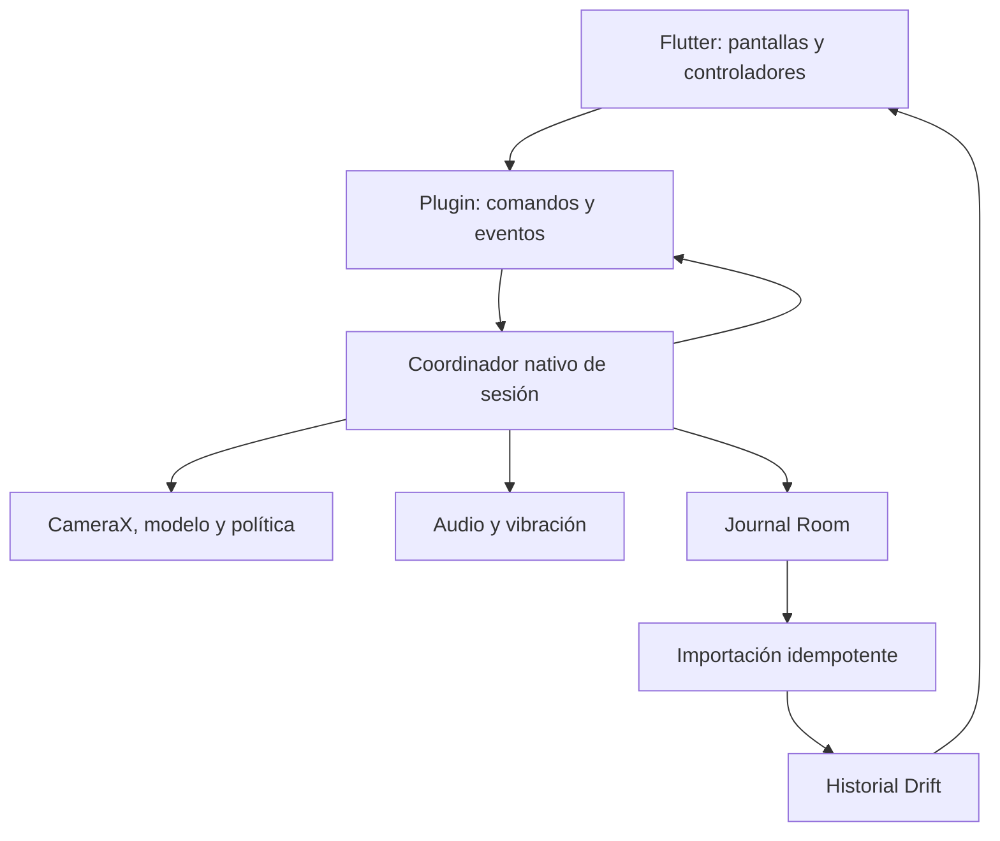

# Vigía · Área 04: arquitectura técnica y contratos

Versión 1.0 · 3 de octubre de 2026  
Autor del proyecto: Juan José Rueda Viveros  
Plataforma implementable inicial: Android. iOS: expansión prevista.  
Estado: especificación técnica para implementación posterior; no acredita código ejecutado, compatibilidad de equipos ni aceptación del detector.

## 1. Alcance y autoridad documental

Esta área define responsabilidades, estados, contratos, persistencia, fallos, organización del repositorio y pruebas de arquitectura. No crea todavía la aplicación ni el repositorio. Los contratos son especificaciones de datos; se convertirán después en declaraciones Pigeon, entidades y migraciones.

Fuentes internas consultadas:

| Documento | Versión consultada | Autoridad |
|---|---|---|
| Vigia_01_PRD_Producto_y_Alcance_v1.1.md | 1.1 | Producto, RF01–RF32, RNF01–RNF10 y criterios |
| Vigia_02_UX_Flujos_y_Navegacion_v1.0.md | 1.0 | P01–P18, D01–D08, navegación, UX01–UX22 y fixtures |
| Vigia_Base_Proyecto_v0.2.md | 0.2 | Base Flutter/Kotlin, reparto de motor y persistencia |
| Resumen de Claude de B5.2 completo | Compartido el 03/10/2026 | Evidencia reportada del prototipo; HTML completo no revisado en esta área |

El PRD vigente sustituye la numeración inicial de doce requisitos de la base. La UX vigente sustituye su inventario inicial de pantallas. El diseño B4.2/B5.2 sustituye la dirección visual anterior; esta área no rediseña sus componentes. Si una decisión técnica contradice un criterio del PRD o UX, se registra la discrepancia antes de implementar.

Claude Design queda en pausa. Pendientes de Área 03: escala real de navegación al 200 %, especificación final de componentes/tokens, licencias y procedencia de recursos, revisión del HTML completo, TalkBack y pruebas nativas, rendimiento del aura y UT01–UT08. La limitación al 135 % no satisface RNF03.CA1 ni UX22.

Convenciones: **decisión de arquitectura** = regla propuesta en esta versión para orientar implementación; **dependencia** = necesita evidencia o especificación de otra área; **prueba prevista** = todavía no ejecutada. Los parámetros de IA pendientes no reciben valores ficticios.

## 2. Stack y límites

| Capa | Elección | Responsabilidad |
|---|---|---|
| Aplicación | Flutter + Dart | Interfaz, navegación, presentación e historial |
| Estado Flutter | Riverpod | Controladores por funcionalidad e inyección de dependencias |
| Navegación | go_router | Rutas y guardas compartidas |
| Historial | Drift + SQLite | Lectura consolidada, preferencias, valoración y exportación |
| Plugin local | Kotlin + Coroutines | Motor Android y API nativa |
| Cámara | CameraX Preview + ImageAnalysis | Captura y preview con un propietario |
| Modelo facial | MediaPipe Tasks Face Landmarker | Inferencia neuronal local de geometría facial |
| Decisión temporal | Política Kotlin versionada | Calidad, ventanas, episodios y motivos |
| Registro del motor | Room + SQLite | Journal durable y recuperación independiente de Dart |
| Comandos | Pigeon | Mensajes tipados Flutter–Kotlin |
| Eventos | EventChannel con codec validado | Snapshots y cambios compactos |
| Sesión Android | Servicio en primer plano de tipo camera | Coordinación durante sesión e indicador del sistema |
| Audio y vibración | APIs Android, encapsuladas | Reproducción, fallos y liberación |

No se introduce backend, cuenta, sincronización, GPS, micrófono, chatbot ni descarga obligatoria del modelo. El modelo incluido se identifica por versión y SHA-256. Face Landmarker no es un clasificador de fatiga: la política temporal se evalúa por separado.

Versiones de Flutter, Dart, Pigeon, paquetes, Kotlin, AGP, Gradle, JDK, SDK y MediaPipe: se fijarán juntas al preparar el repositorio, después de resolver compatibilidad y construir el plugin. Conservar pubspec.lock, Gradle Wrapper y catálogo Android. No usar rangos dinámicos Android ni declarar una versión como verificada sin compilación. minSdk 26 permanece candidato de la base; compileSdk, targetSdk y equipos soportados están pendientes. iOS no aparece como plataforma disponible en V1.

## 3. Componentes y responsabilidades

| Componente | Puede hacer | No puede hacer |
|---|---|---|
| Widgets | Renderizar estado, semántica y acciones | Ejecutar SQL, analizar imágenes o inferir éxito de un comando |
| Controladores Riverpod | Pedir acciones y representar pendientes | Crear episodios o calcular calidad desde el preview |
| Dominio Dart | Calcular resúmenes desde registros, validar alias y exportación | Importar CameraX/MediaPipe o decidir cierre ocular |
| Repositorios Dart | Consolidar journal, persistir preferencias y consultas | Confirmar ACK antes del commit o restaurar IDs borrados |
| Codec del plugin | Validar esquema y convertir mensajes | Reinterpretar códigos desconocidos como éxito |
| SessionCoordinator | Serializar órdenes y mantener estado real | Depender de que P06 siga montada |
| MonitoringPipeline | Captura, calidad, observaciones y política | Guardar imágenes o enviar fotogramas a Dart |
| AlertDispatcher | Reproducir y registrar resultados técnicos | Declarar que el conductor oyó el sonido |
| NativeJournal | Registrar hechos y checkpoints | Fabricar observaciones tras cierre del proceso |

El motor nativo es autoridad de sesión, medición, señales, calibración y resultados técnicos de sonido. Drift es autoridad de preferencias de producto, valoraciones y lecturas consolidadas. Una copia en Flutter de la sesión actual es una proyección; nunca un segundo coordinador. La referencia de calibración replicada en Drift es de lectura; su aceptación/invalidez se decide en Kotlin.

El coordinador es único en el proceso de aplicación y se comparte con el servicio y el plugin. Recrear la Activity o el FlutterEngine no crea otro coordinador mientras el existente siga vivo. Reanexar el plugin conserva engineInstanceId y consulta el snapshot.

## 4. Estados separados y transiciones

### 4.1 Ejes públicos

| Eje | Valores de contrato | Significado |
|---|---|---|
| Sesión | none, starting, active, paused, stopping, finalized, interrupted | Ciclo confirmado del motor |
| Medición | initializing, usable, limited, unavailable | Disponibilidad y calidad actuales |
| Señal | notEvaluable, noPersistentSignals, warning, prolongedEyeClosure | Resultado que admite la política |
| Conexión UI | resolving, connected, unavailable | Vigencia del estado recibido por Flutter |
| Orden | pending, succeeded, rejected, failed | Estado de una operación identificada |
| Registro | pending, complete, incomplete | Consolidación y pérdidas conocidas |

Preparando y Calibrando son estados del flujo previo, sin sessionId ni tiempo de sesión. Pausando y Reanudando son representaciones de una orden pendiente; no son confirmaciones de pausa/reanudación. Finalizando corresponde a stopping. Interrupted es terminal: no se convierte en active mediante resumeSession.

Con usable y ventanas reconstruidas se permite un resultado evaluable. Con initializing, limited o unavailable el resultado público es notEvaluable en V1. Estar active no implica medición usable. Audio tiene estado separado; un fallo de reproducción no convierte una medición ocular válida en inválida.

### 4.2 Matriz de acciones

| Estado confirmado | Acción | Resultado aceptado | Rechazo o fallo |
|---|---|---|---|
| none / terminal sin sesión vigente | startSession | starting → active, nuevo ID | Preparación permanece; intento fallido si hubo registro preliminar |
| active | pauseSession | paused, abre una pausa | Conserva active si no hubo transición |
| paused | resumeSession | active, mismo ID, cierra pausa | Conserva paused y la pausa abierta |
| active / paused | stopSession | stopping → finalized | Recursos se detienen; registro incomplete si falla escritura |
| starting / stopping o comando incompatible pendiente | Otro comando incompatible | Ninguno | operationInProgress |
| interrupted / finalized | resumeSession | Ninguno | sessionNotResumable |
| Conexión unavailable | Nuevo inicio o acción destructiva | Ninguno | Consultar snapshot; no suponer ausencia de sesión |

Las solicitudes repetidas del mismo comando no crean una transición adicional. Una consulta de estado está permitida durante una transición. startSession y operaciones destructivas se excluyen mutuamente en el coordinador.

### 4.3 Reglas de los recorridos

Inicio exige, de nuevo en Kotlin: permiso, cámara disponible, modelo cargado, ojos evaluables según Q, referencia aplicable y prueba sonora técnicamente correcta más confirmación humana. La habilitación del botón Flutter no sustituye estas comprobaciones.

Cambié la posición incrementa mountRevision y marca referencia no aplicable. La operación se confirma por el motor; calibrar crea una nueva referencia para esa revisión. No se promete detectar automáticamente el movimiento del soporte.

Pausar descarta ventanas y detiene detección; libera los casos de uso de cámara de la sesión. Reanudar adquiere cámara desde la actividad visible, verifica permiso/modelo/referencia y reúne Q: la pausa sigue abierta hasta confirmar observaciones utilizables. Volver de Ajustes no ejecuta resumeSession. Los callbacks de un intento de reanudación cancelado no pueden cerrar la pausa.

La calibración nunca se inicia con sesión vigente. Si la referencia deja de ser compatible, se finaliza la sesión y se prepara otra; no se sustituye silenciosamente la referencia de la sesión actual.

## 5. Identidad, relojes y orden

| Campo | Tipo lógico | Regla |
|---|---|---|
| schemaVersion | entero positivo | Versión del contrato; inicial 1 |
| datasetId | UUID | Espacio de datos local; no identifica una persona |
| engineInstanceId | UUID | Cambia al recrear el coordinador; invalida continuidad asumida |
| sessionId, episodeId, intervalId, commandId, recordId | UUID | Unicidad; nunca reutilizados tras borrado |
| stateRevision | entero de 64 bits | Aumenta con cambios confirmados del coordinador |
| eventSequence | entero de 64 bits | Orden de emisión dentro de engineInstanceId |
| sessionOffsetMs | entero de 64 bits, ≥0 | Duración relativa desde inicio en reloj monotónico |
| occurredAt | cadena ISO 8601 con offset | Fecha civil informativa |
| zoneId | cadena IANA | Zona registrada, por ejemplo America/Bogota |
| payloadHash | SHA-256 hexadecimal | Detecta alteración de un registro exportable |

Kotlin usa reloj monotónico para duración y política; las fechas civiles se guardan para presentación. No comparar valores monotónicos entre reinicios del teléfono o nuevas instancias sin evidencia de continuidad. Un cambio del reloj civil no cambia duración ya medida.

El timestamp de captura se conserva con su dominio de reloj. Para latencia se documenta la correspondencia con el reloj monotónico del proceso y se prueba su conversión. Un timestamp tomado al enviar una imagen al modelo se denomina submitAt; no se publica como captureAt.

Un cambio de zona no reescribe fechas originales. Periodos y retención calculan fechas en la zona local consultada para esa operación y muestran zona/corte; sesiones se seleccionan por fecha de inicio. No usar 24×N horas para sustituir N fechas locales.

## 6. Contrato común de órdenes

Todo comando mutante incluye CommandContext:

| Campo | Obligación |
|---|---|
| schemaVersion, datasetId, commandId | Siempre |
| expectedEngineInstanceId | Siempre después del handshake; rechazar si cambió |
| sessionId | Pausa, reanudación y cierre; null en preparación/inicio |
| expectedStateRevision | Revisión leída al habilitar la acción; un cambio incompatible exige consulta |

CommandResult incluye commandId, status, errorCode nullable, retryDisposition, engineInstanceId, stateRevision y snapshot vigente si existe. status=pending solo confirma aceptación de trabajo; no éxito. succeeded exige las postcondiciones particulares. rejected significa que no se realizó la transición. failed identifica un error durante su ejecución; el snapshot determina qué estado quedó.

retryDisposition: queryState, retrySameCommand, newAttemptAfterCorrection o notRetryable. Flutter no reintenta automáticamente comandos mutantes con IDs nuevos.

Decisiones de idempotencia:

- El coordinador procesa mutaciones en un único actor/cola serial; inferencia y E/S trabajan fuera del hilo principal y entregan resultados a ese actor.
- Registrar commandId y resultado de operaciones de sesión/borrado en el journal. Un duplicado con el mismo payload devuelve el estado/resultados de la orden original.
- Un commandId repetido con distinto payload se rechaza con commandPayloadMismatch.
- Diez taps comparten una orden desde el controlador; el motor también protege contra diez IDs distintos de inicio dentro de la misma preparación: solo el primero consume el preparationId.
- Órdenes de preparación efímeras se deduplican durante engineInstanceId; después de reinicio se exige nueva preparación. No se restaura una confirmación humana de sonido de una instancia perdida.
- expectedStateRevision es una precondición optimista. Si solo cambiaron contadores o llegó otra observación compatible, el motor vuelve a validar precondiciones y puede aceptar. Si cambió sesión, lifecycle, referencia, permiso o hay orden incompatible, rechaza; no hace fallar todos los comandos por los ticks de métricas.
- Un resultado tardío de otra instancia/sesión nunca reemplaza el estado actual. Una revisión menor no hace retroceder la UI.
- Tras 5 s sin resultado terminal, la UI muestra Confirmación pendiente y consulta estado/orden. Ese tiempo no cancela el comando ni acredita fallo.

## 7. API pública del plugin

Esta tabla fija nombres y postcondiciones. Los DTO se definirán en pigeons/monitoring_api.dart; los nombres no autorizan usar Map sin validación en las pantallas.

| Operación | Entrada específica | Salida / postcondición |
|---|---|---|
| getCapabilities | supportedSchemaVersions | Capabilities o schemaUnsupported; no abre cámara |
| getSessionSnapshot | knownEngineInstanceId?, commandIdToResolve? | Snapshot completo y estado de orden si se consulta |
| openPreparation | CommandContext | preparationId; no crea sesión; permite preview tras permiso |
| getPreparationSnapshot | preparationId | Las seis precondiciones con códigos y referencia actual |
| closePreparation | preparationId + contexto | Cancela captura/calibración/prueba y libera preview |
| declareMountChanged | preparationId + contexto | mountRevision nueva; referencia no aplicable |
| beginCalibration | preparationId + contexto | calibrationAttemptId y progreso; resultado aceptado o causa |
| cancelCalibration | calibrationAttemptId + contexto | Adquisición detenida; ningún resultado tardío se acepta |
| testSound | preparationId + patternId + contexto | soundTestId; reproduced o fallo técnico |
| confirmSoundHeard | preparationId + soundTestId + contexto | Confirmación vinculada a prueba exitosa y patrón |
| startSession | preparationId + calibrationId + soundTestId + contexto | Única sesión; active solo tras confirmar inicio |
| pauseSession | contexto con sessionId | paused y pauseIntervalId únicos |
| resumeSession | contexto con sessionId | active tras Q; conserva ID y descarta ventana anterior |
| stopSession | contexto con sessionId | Sin adquisición/avisos; terminal y estado de guardado |
| readPendingRecords | datasetId + cursor? + limit | Lote consistente; límite inicial máximo 100 registros |
| acknowledgeRecords | batchId + recordId/payloadHash[] | ACK de esas revisiones exactas; nunca ACK global por sessionId |
| deleteMonitoringData | deletionOperationId + scope + contexto | Borrado durable nativo idempotente o pendiente/error |

scope de borrado: sessionIds explícitos para sesión/retención, o datasetReset para borrar todo. datasetReset incluye también referencias y registros asociados; el alias pertenece a Drift y lo elimina la coordinación Dart. No invocar borrado nativo mientras exista una sesión vigente.

### 7.1 Capabilities

Campos: schemaVersion, platform, engineVersion, supported=true/false, supportedCaptureModes, modelStatus, modelId, modelVersion, modelSha256, policyVersion, calibrationSchemaVersion, supportsNativeAlerts, supportsDurableJournal y continuityScenarios.

Cada continuityScenario incluye escenario, qualification=untested/supported/unsupported, build del equipo probado y referenceReportId nullable. Un bool de disponibilidad de API no demuestra continuidad. Sin ensayo de dispositivo se mantiene untested. Flutter no muestra soporte iOS ni modo de cámara externo por la existencia del contrato.

### 7.2 PreparationSnapshot

Campos: preparationId, engineInstanceId, stateRevision, mountRevision, permissionStatus, cameraStatus, modelStatus, facePresent, eyeQualityStatus, calibrationId nullable, calibrationApplicable, soundPatternId, soundTestId nullable, soundTechnicalStatus, heardConfirmed y blockers[] tipados.

Una preparación solo puede consumirse una vez. Cambiar patrón sonoro, declarar montaje distinto o cambiar modelo invalida las comprobaciones correspondientes. Antes de cada nueva sesión se exige otra prueba y confirmación de sonido. La prueba no usa micrófono.

### 7.3 SessionSnapshot

Campos obligatorios: schemaVersion, datasetId, engineInstanceId, stateRevision, eventSequence, emittedMonotonicMs, sessionId nullable, lifecycle, measurement, signal, audioStatus, recordStatus, pendingCommandId nullable, failureCodes[], modelVersion y policyVersion si hay sesión. Con sesión: startedAt, zoneId, sessionOffsetMs, calibrationId, calibrationSnapshotHash, lastProcessedFrameOffsetMs nullable y latestDurableOffsetMs nullable.

audioStatus: ready, playing, degraded, unavailable; recordStatus distingue cola pendiente de pérdida de escritura. Desconexión UI no modifica el snapshot nativo; es un estado de presentación.

### 7.4 CalibrationResult

Aceptado: calibrationId, schemaVersion, modelVersion/modelSha256, calibrationConfigVersion, mountRevision, createdAt, acceptedSummary y parámetros de referencia compactos. Rechazado: insufficientObservations, invalidEyeQuality o unstableReference. Cancelado: canceled; nunca accepted.

La fórmula de acceptedSummary y los parámetros exactos se cierran con Kcal en Área 05. La forma del contrato admite versionarlos sin guardar landmarks completos. Cada sesión conserva la instantánea inmutable usada.

## 8. Eventos, vigencia y reconexión

EventEnvelope: schemaVersion, datasetId, engineInstanceId, eventSequence, stateRevision, sessionId nullable, emittedMonotonicMs, eventType y payload validado. Tipos: snapshot, commandChanged, preparationChanged, calibrationProgress, calibrationFinished, measurementChanged, signalChanged, episodeChanged, playbackChanged, recordStatusChanged y technicalFailure.

El stream es transporte de presentación; no sustituye al journal. Para estados y alarmas usar eventos inmediatos sin esperar al siguiente tick de métricas. Contadores visuales se derivan de un ancla confirmada; no emiten un evento por frame.

**Propuesta de transporte V1, sometida a pruebas:** heartbeat con snapshot cada 1000 ms cuando Flutter está suscrito; después de 3000 ms sin mensaje válido medidos por recepción monotónica Dart, declarar conexión unavailable y consultar snapshot. Error/cierre del canal produce unavailable inmediatamente. Estos valores son de conexión UI; no sustituyen Tstale ni umbrales del detector. Medirlos y versionarlos antes de cambiarlos.

En Dart activo, heartbeat no depende de frames nuevos. Un heartbeat con medición unavailable demuestra conexión al motor, no buena medición. UI suspendida no genera avisos por su reloj detenido: al volver siempre consulta snapshot.

Reconexión:

1. Suscribir el stream y almacenar temporalmente mensajes recibidos.
2. Consultar capabilities y snapshot con timeout de transporte identificado.
3. Aplicar snapshot; descartar mensajes de otra instancia o con secuencia/revisión anterior.
4. Aplicar mensajes posteriores compatibles y comenzar conciliación del journal.
5. Si hay salto de secuencia, volver a consultar snapshot; recuperar hechos desde journal, no reconstruirlos contando eventos del stream.
6. Si native no responde, mantener restricciones de sesión incierta. No mostrar una nueva preparación habilitada.

El plugin conserva una sola suscripción efectiva de presentación. Cambiar rutas no crea otro analizador ni otra sesión. Un engineInstanceId nuevo obliga a resolver registros sin cierre antes de permitir startSession.

## 9. Pipeline de cámara e IA

Secuencia: FrameSource → FaceAnalyzer → QualityEvaluator → FeatureExtractor → TemporalAggregator → DetectionPolicy → AlertDispatcher + NativeJournal.

| Interfaz | Entrada | Salida |
|---|---|---|
| FrameSource | Modo de captura | Frame temporal con orientación y propietario de memoria |
| FaceAnalyzer | Imagen y timestamp de entrada | Geometría transitoria o error; versión de modelo |
| QualityEvaluator | Geometría, imagen y continuidad | Q válida/inválida, motivos y datos compactos |
| FeatureExtractor | Observación válida + referencia | Características con unidades y versión |
| TemporalAggregator | Características temporales | Ventanas después de cortes y cobertura |
| DetectionPolicy | Ventanas + configuración inmutable | Señal, motivo y apertura/cierre de episodio |
| AlertDispatcher | Decisión con episodeId | Resultado técnico por intento de aviso |
| ModelProvider | Manifiesto de modelo | Modelo verificado o modelUnavailable |

Decisiones de ejecución:

- CameraX usa STRATEGY_KEEP_ONLY_LATEST como base; no crece una cola de imágenes [S4].
- Adaptador copia/construye la imagen que necesita MediaPipe y libera ImageProxy cuando termina de usar sus datos. El recurso de entrada propio del modelo vive hasta que termina su uso asíncrono; nunca reciclarlo mientras está en proceso.
- Inferencia no corre en el hilo principal Android ni en el isolate de UI Flutter. Un permiso en el hilo correcto del canal no autoriza cálculo pesado en él.
- Cada frame lleva frameId y captureGeneration. Pause/stop/reconfiguración incrementan la generación; callbacks antiguos se descartan y liberan recursos.
- Timestamp de entrada MediaPipe es creciente dentro de cada instancia. Un error de reloj/orden se informa; no reordenar resultados para fabricar continuidad [S6].
- Preview frontal puede estar espejado para el usuario; el cálculo usa orientación documentada sin depender del espejo visual.
- No transferir imágenes, mallas faciales ni series por fotograma a Dart. El preview usa superficie nativa con lifecycle del coordinador; desmontarla no termina sesión.
- La política no reutiliza muestras previas a pausa, pérdida, cambio de referencia o nueva sesión. Una observación inválida rompe continuidad ocular.

Q, Kcal, W, C, Tclose, Eend, Rrepeat, Tstale y Krecover continúan pendientes del Área 05. La atribución temporal de calidad entre muestras y la cobertura de las ventanas deben quedar definidas allí; no asignar todo hueco entre frames al último valor válido por comodidad.

Métrica ocular y parámetros de confianza de MediaPipe son conceptos distintos. No presentar una confianza facial como porcentaje de fatiga. Recolección de imágenes para investigación requerirá procedimiento separado; V1 no las persiste.

## 10. Ciclo de vida Android y alertas

Crear la sesión desde una actividad visible y con permiso concedido. El servicio declara tipo camera y los permisos que requiera el targetSdk elegido. No se inicia captura mediante boot, tarea programada o recuperación automática. Las restricciones de creación de servicios con permisos de uso activo se verifican según Android/targetSdk [S2, S3].

Preparación usa adquisición ligada a actividad visible. Al ir a ajustes del teléfono se suspende/libera esa adquisición y al volver se vuelven a comprobar las condiciones. Durante sesión la adquisición pertenece al coordinador del servicio, no al widget de preview ni a Activity onStop. La viabilidad de esta unión CameraX/lifecycle es un objetivo del primer ensayo técnico.

Servicio y Activity en el mismo proceso inicial. Se evita un segundo proceso Android; Room protege frente a desconexión/suspensión de Dart y recuperación posterior, pero no hace sobrevivir código a la muerte del proceso. El servicio no reinicia análisis por intención sticky. Mantener una pausa sin cámara conserva su registro; si el sistema termina el proceso, al volver se marca interrumpida y no se reanuda.

| Suceso | Respuesta especificada |
|---|---|
| Cambiar de P06 a P03 | Conserva sesión e inferencia; solo cambia presentación |
| Otra app / pantalla bloqueada | Solo se declara continuidad para combinaciones probadas; hueco produce RF14 |
| Permiso retirado / cámara ocupada | unavailable + notEvaluable; causa y corte de continuidad |
| Modelo falla | No evaluable; no reemplazar por simulación |
| Flutter se desconecta | Motor puede continuar si Android lo permite; al regresar consultar estado |
| Proceso muere | Recuperación terminal interrupted, final desconocido sin reinicio de cámara |
| Finalizar | Invalida callbacks, detiene análisis y sonidos, libera cámara y servicio sin esperar Drift |

No pedir permisos de llamadas para identificar una interrupción: medir disponibilidad real de cámara/audio. El protocolo RNF04 incluye llamada recibida como escenario observado.

AlertDispatcher selecciona recursos locales por patternId. Cada aviso mantiene playbackId, episodeId, ordinal, requestedOffsetMs, startedOffsetMs nullable, finishedOffsetMs nullable y resultado técnico. RF12 puede escalar una advertencia sin esperar su intervalo de repetición; el episodio conserva ID y registra el cambio de categoría. La regla detallada de episodios/retornos pertenece a Eend/Rrepeat.

Pérdida de audio focus, error o ruta de salida no comprobada se muestran como degradación sonora; no afirmar reproducción ni audibilidad. Con una decisión ocular válida se conserva el episodio y la alerta visual aunque falle el sonido. Tras corregir, recuperación sonora debe verificarse; no ocultar el fallo con un timer.

Patrón sonoro, AudioAttributes, AudioFocusRequest, audio focus, vibración y cambios de ruta se cierran en el ensayo nativo con altavoz y Bluetooth. No se promete que llamadas, silencio o restricciones del sistema permitan siempre sonar [S5]. Un fallo de audio no modifica Q ni se registra como somnolencia. Mantener audio operativo es parte de la preparación y estado del producto.

## 11. Persistencia: hechos y proyecciones

Room conserva journal inmutable, materialización nativa mínima de la sesión actual, calibraciones y operaciones necesarias para recuperación. Drift conserva entidades consolidadas, preferencias, feedback, solicitudes de borrado y control de importación. No abrir directamente la base Room desde Dart.

JournalRecord: recordId, datasetId, journalSequence, sessionId nullable, recordType, occurredAt, sessionOffsetMs nullable, payloadSchemaVersion, payload, payloadHash. El payload exportable utiliza serialización canónica documentada. Cada nueva revisión genera otro recordId; un ACK no confirma versiones posteriores.

Tipos mínimos de hecho: sessionStartAttempt, sessionStarted, sessionStartFailed, intervalOpened, intervalClosed, progressCheckpoint, episodeOpened, episodeUpdated, episodeClosed, playbackResult, sessionFinalized, interruptionRecovered, calibrationAccepted y technicalFailure. Comandos/borrado usan tablas de operación separadas, no se cuentan como episodios.

Persistir límites de intervalos y cambios de episodio cuando ocurren. **Propuesta inicial de checkpoint:** como máximo cada 1000 ms mientras se acumulan spans conocidos, con último límite temporal realmente confirmado; se mide coste de E/S. El checkpoint no autoriza extrapolar calidad o completar un cierre ausente. No hay commit por cada frame.

La alerta nativa no espera a Drift ni a internet. La intención de registrar y reproducción se coordinan sin bloquear sonido por E/S. Si Room falla, se informa recordStatus=incomplete; una cola limitada puede conservar temporalmente hechos, pero no se llama durable. El tamaño/límite de esa cola se fija antes de implementar; al agotarse se registra pérdida conocida en snapshot y no se afirma recuperación íntegra.

### 11.1 Entidades consolidadas

| Entidad | Campos mínimos y restricciones |
|---|---|
| sessions | sessionId PK, datasetId, inicio civil/zona, lifecycle terminal o vigente, final nullable, último offset durable, versión/hash de modelo, política, configuración de calibración, instantánea de referencia, integridad y marca de consolidación |
| session_intervals | intervalId PK, sessionId FK, kind evaluable/nonEvaluable/paused/unknown, inicio offset, fin nullable, causa; sin solapamiento de tiempos consolidados |
| episodes | episodeId PK, sessionId FK, inicio/final nullable, categoría inicial/máxima, motivo, calidad resumida, evidencia compacta, versiones |
| episode_transitions | ID PK, episodeId FK, offset y categoría; no aumenta conteo de episodios |
| alert_playbacks | playbackId PK, episodeId FK, ordinal, tiempos, patternId y estado técnico |
| episode_feedback | episodeId PK/FK, useful/notPerceived/unsure, fecha; no altera detección |
| calibrations | calibrationId PK, versión/hash, mountRevision, fecha y referencia compacta |
| preferences | Clave única, valor validado y versión; tema, sonido, retención, alias, explicación vista |
| imported_records | recordId PK, payloadHash, datasetId y posición journal |
| deletion_operations | operationId PK, alcance congelado, etapa, estado y error |
| deletion_tombstones | datasetId + sessionId o epoch retirado; barrera contra restauración |

Las relaciones usan FK y cascadas para entidades de sesión. Validar duraciones no negativas, final≥inicio cuando ambos son conocidos y estado terminal sin cierre como incompleto/desconocido. Un dato faltante es null, nunca cero por defecto.

Alias: trim de espacios Unicode en extremos, normalización NFC y máximo 40 valores escalares Unicode. Validar igual en dominio y escritura; documentar que un emoji compuesto puede ocupar varios valores. Vacío elimina alias. No es identificación biométrica ni requisito de inicio.

Valoración editable solo para sesiones finalized según UX16. Cambiarla sustituye ese dato, conserva episodio y no entrena ni cambia política. Para interrupted no se ofrece edición en V1.

## 12. Consolidación y recuperación

Protocolo:

1. readPendingRecords entrega batchId, records[], nextCursor, hasMore y highWatermark consistente del lote.
2. En transacción Drift: validar versiones/hash, descartar datos tombstoned, insertar imported_records y aplicar hechos nuevos en orden journalSequence. Un recordId existente con el mismo hash es no-op; con distinto hash es error de integridad, no sobrescritura.
3. Commit Drift. Solo después enviar ACK de recordId/hash procesados, incluidos registros descartados por una barrera de borrado durable.
4. Reintentar ACK con el mismo lote si falla; no borrar journal antes de confirmación.
5. Consultar hasta completar el highWatermark de cierre. complete exige metadatos y límites necesarios, ningún hecho faltante conocido y ausencia de pérdida declarada.

batchId no es garantía de persistencia Drift. Un salto journalSequence o registro de versión no soportada mantiene pending/incomplete y una causa. Registros confirmados pueden depurarse del outbox; no eliminar la sesión actual ni deduplicación necesaria para comandos por depurar ese outbox.

Si la app cae después de commit y antes de ACK, volver a importar conserva IDs y conteos. Si un episodio se actualiza después de crear un lote, un ACK de su primera revisión no elimina la revisión nueva.

Al abrir: resolver snapshot y journal. Si coordinador vivo confirma una sesión, reconectar al mismo ID. Si la instancia anterior perdió ejecución y no existe cierre durable, registrar interruptionRecovered una sola vez y representar interrupted. El instante de recuperación no es la fecha de fin ni evidencia de observación. Sin extremo final confirmado se muestra Final desconocido.

## 13. Borrado y retención entre dos bases

No hay una transacción atómica común entre Room y Drift. Usar una operación durable por etapas con barreras de importación. No anunciar éxito hasta terminar ambas bases.

| Etapa | Acción y garantía |
|---|---|
| intentSaved | Drift guarda operationId, alcance exacto y tombstones en una transacción; importación excluye ese alcance desde ese commit |
| nativeDeleted | Kotlin comprueba ausencia de sesión vigente, borra journal/materializaciones/referencias incluidas y confirma de forma idempotente |
| localDeleted | Drift aplica cascadas y borra datos incluidos; conserva barreras/operación técnica necesarias |
| complete | Ambas confirmaciones existen; UI comunica éxito |
| pending/error | Mantener barrera y alcance; reanudar mismas etapas/operationId al volver |

El coordinador Dart serializa importación y borrado. Una importación que ya estaba en marcha termina antes de guardar la intención; después se aplican cascadas. Una que empieza después observa tombstones. El motor excluye startSession mientras ejecuta el borrado; no basta ocultar un botón. Al abrir la app, resolver operaciones de borrado pendientes antes de habilitar preparación/inicio. Si siguen fallando, se mantiene el bloqueo y se permite consultar/reintentar la operación.

Al borrar todo, retirar datasetId anterior y crear uno nuevo solo tras completar eliminación; borrar referencias y alias, reiniciar preparación y confirmación sonora. Tema puede conservarse. Una barrera técnica mínima del dataset retirado impide importar lotes antiguos; no conserva alias, referencia ni datos faciales. No se consideran borradas las copias exportadas fuera de la app.

Si el guardado de intención falla, no comenzar borrado en la otra base. Si solo una base termina, mostrar Eliminación pendiente, bloquear operaciones incompatibles y reintentar sin restaurar datos. La operación iniciada no se cancela por cerrar el diálogo.

Retención: 90 días iniciales; 30/90/180/Hasta que los borre. corte = inicio de hoy local menos N−1 fechas. Borrar sesiones cerradas cuyo inicio<corte; igualdad conserva. Se ejecuta al abrir y después de cerrar/consolidar. Una sesión vigente nunca entra en el alcance. D04 congela IDs/corte/cantidad confirmados; si cambia el conjunto antes de ejecutar se vuelve a presentar el alcance. Si reducir retención inicia borrado, se registra nuevo valor y operación pendiente sin declarar limpieza terminada.

## 14. Métricas, resúmenes y exportación

Fórmulas desde spans persistidos sin solapamientos:

- cobertura = evaluableMs / (evaluableMs + nonEvaluableMs).
- episodiosPorHora = episodiosUnicos × 3 600 000 / evaluableMs.
- tiempoRepresentado = evaluableMs + nonEvaluableMs + pausedMs + unknownMs cuando los límites están acotados.
- Denominador cero: null y No disponible. No promediar porcentajes individuales para obtener cobertura agregada.

Desconocido acotado puede sumarse a tiempo representado, como DS01. Un extremo final sin confirmar como DS02 no tiene duración hasta la reapertura: no fabricar unknownMs para ese periodo. Repeticiones sonoras y cambios de categoría no aumentan episodios únicos. Tendencias de 7/30 fechas locales agrupan por versión de política; configuración que altera interpretación debe tener una versión nueva.

JSON V1 incluye schemaVersion, exportedAt, zoneId, datasetMode, selección y versiones; sesiones, episodios, intervalos, pausas y valoraciones. CSV produce sesiones y episodios con IDs relacionados, UTF-8, encabezados, duraciones en ms y fechas ISO 8601 con offset; escapar coma/comillas/CR/LF. Especificación columna a columna y ejemplos completos: subárea de datos antes de implementar exportación.

Congelar selección en lectura consistente Drift antes del selector de archivo. Usar Storage Access Framework del sistema; no requerir permiso general de archivos. Resultado por archivo: pending/written/canceled/failed y causa. written solo después de escritura y cierre correctos. Dos CSV con uno escrito y otro cancelado producen D08; reintentar solo archivos pendientes de la misma selección. No se comparte automáticamente a otra persona.

## 15. Navegación, diseño y privacidad

Guardas centrales y validación en acciones: sesión vigente incluye active, paused, starting, stopping, orden de sesión pendiente y estado incierto. Bloquear P09–P11 y P13–P18, tutorial, exportación, retención, valoración y borrado. P03↔P06 conserva ID. P08 puede listar con restricciones; P12 permite tema. Aplicar también a enlaces directos y al volver de una pantalla externa.

Una acción disparada desde un controlador valida nuevamente el estado aunque se haya abierto la ruta antes. No convertir navegación a Inicio en pauseSession. Finalizar confirmado impide reconstruir P06 como sesión vigente por el historial del router.

Tokens y componentes Flutter centralizados en core/design_system; no copiar todo el HTML dentro de WebView. Inter y recursos locales, pendientes de licencia verificada. El aura se confina a contextos detenidos definidos en B4.2; P06 estable, alerta inmediata, preferencia de movimiento reducido respetada. No capar texto para aprobar pruebas de overflow: composición adaptable y todos los controles esenciales accesibles al 200 %.

Datos en almacenamiento interno privado. No afirmar cifrado de base por usar SQLite/Room/Drift. **Decisión de distribución V1:** excluir bases de sesiones, referencias y archivos internos de exportación de backup/restauración automática y transferencia de dispositivo mediante configuración Android aplicable, y probar restauración. Hasta ese ensayo no declarar protección frente a resurrección por backup. Compartir/exportar crea copias externas explícitas.

No guardar imágenes, video, landmarks completos ni información de rostros en logs. Logs técnicos: códigos, IDs de prueba, tiempos y versiones sin alias. Sin analítica remota en V1. La manifest release no solicita INTERNET para el núcleo; permisos de depuración no justifican incluirlo en producción.

## 16. Catálogo inicial de errores

| Código | Resultado visible / acción |
|---|---|
| cameraPermissionDenied | Cámara sin permiso; solicitar o abrir Ajustes según Android |
| cameraUnavailable | Cámara no disponible; comprobar recurso y reintentar |
| modelUnavailable / modelHashMismatch | Modelo no disponible; bloquear inicio; no descargar/simular en silencio |
| eyesNotEvaluable | Ojos no evaluables; corregir condiciones |
| calibrationRequired / calibrationIncompatible | Repite calibración |
| soundTestRequired / soundPlaybackFailed | Prueba pendiente o No se pudo reproducir |
| insufficientObservations / invalidEyeQuality / unstableReference | Rechazo de calibración específico |
| sessionAlreadyCurrent | Consultar sesión vigente; no crear otra |
| sessionNotResumable / sessionMismatch | Consultar estado; no cambiar otro ID |
| operationInProgress / staleStateRevision | Esperar o consultar; no duplicar orden |
| engineInstanceChanged / schemaUnsupported | Invalidar proyección y resolver contrato; bloquear mutaciones |
| commandPayloadMismatch | Fallo de contrato; no ejecutar payload modificado |
| inferenceFailed / observationStale | No evaluable; registrar causa y reiniciar continuidad |
| audioFocusLost / audioRouteUnverified | Estado sonoro degradado; no afirmar audibilidad |
| journalWriteFailed / historyWriteFailed / recordIntegrityFailed | Registro incompleto o pendiente según pérdida/cola |
| deletionPending / deletionFailed | Sin éxito; barrera de restauración y reintento |
| exportCanceled / exportWriteFailed | Cancelación/error individual; D08 si parcial |
| unsupportedPlatform | Plataforma no disponible |

Cada error incluye código estable, componente, commandId/sessionId cuando correspondan, instante, recoverable y retryDisposition. Los textos traducidos viven en Flutter; no analizar strings Android para determinar comportamiento. Un error desconocido se muestra como fallo identificado genérico y se conserva como código técnico; nunca éxito.

## 17. Estructura prevista del repositorio

Una app Flutter y un plugin local. No se crean ahora carpetas vacías, backend ni proyecto iOS ficticio.

| Ruta prevista | Contenido |
|---|---|
| README.md | Propósito, arranque, builds reales/demo y límites |
| AGENTS.md | Reglas compartidas para Codex y Claude Code |
| CLAUDE.md | Referencia a AGENTS.md y comandos específicos del entorno |
| docs/product.md, ux.md, architecture.md | Especificaciones vigentes y precedencia |
| docs/design-system.md, screens.md | Tokens/componentes y mapa P/D/estados |
| docs/ai.md, data.md, testing.md, roadmap.md | Políticas, datos, protocolos y secuencia |
| docs/decisions/ | ADR con contexto, decisión y consecuencias comprobables |
| lib/app/ | Arranque, router, providers y resolución de sesión |
| lib/core/design_system/ | Tokens, temas, componentes y movimiento |
| lib/core/database/ | Drift, migraciones e importación |
| lib/core/monitoring/ | Adapter tipado del plugin, conexión y codec |
| lib/features/{onboarding,preparation,calibration,monitoring,history,settings}/ | presentation/domain/data según necesidad real |
| packages/monitoring_engine/lib/ | API Dart pública; sin dependencias de widgets de producto |
| packages/monitoring_engine/pigeons/ | Contrato fuente y configuración de generación |
| packages/monitoring_engine/android/ | plugin, coordinator, camera, inference, policy, journal, alerts |
| test/, integration_test/ | Dominio, widgets y flujos Flutter |
| packages/monitoring_engine/android/.../test y androidTest | Unitarias e instrumentación nativa |
| testdata/ | Fixtures versionados con entrada y salida esperadas |
| ml/ | Manifiesto del modelo y evaluación; datos personales no en Git |

Imports: presentación usa dominio/abstracciones; datos implementa repositorios; composición en app conecta providers. No SQL en widgets, canales crudos por pantalla ni dependencia de plugin Android en dominio Dart. No crear una clase de caso de uso para cada getter trivial.

Builds real/demo: applicationId y nombres de bases distintos; demo tiene rótulo en monitoreo, historial/exportación. Solo composición demo puede conectar simuladores. Los fixtures quedan en testdata y no entran en assets reales. Prueba de build inspecciona wiring y contenido empaquetado.

## 18. Reglas de trabajo con Codex y Claude Code

1. Cada tarea declara RF/UX/AT afectados, archivos previstos y resultado observable.
2. Leer especificaciones y ADR vigentes antes de cambiar contrato o comportamiento.
3. No rellenar parámetros de IA, resultados de pruebas ni soporte de equipos con valores arbitrarios.
4. Un cambio de DTO se realiza en fuente Pigeon y codec; regenerar ambos lados. No editar generados a mano.
5. Persistencia requiere migración compatible y fixture previo; no borrar la base para hacer pasar pruebas.
6. Cambios de política/modelo/versiones de calibración no alteran sesiones antiguas; conservar manifiestos.
7. Probar fallos/reintentos donde exista estado durable, recursos o efectos; snapshots de UI solos no prueban esos contratos.
8. No introducir nube, permisos o dependencias de otra plataforma sin ADR y alcance explícito.
9. Informar qué se ejecutó, equipo/build y qué quedó pendiente. Un test definido no equivale a aprobado.
10. Evitar edición simultánea del mismo archivo entre agentes/herramientas; coordinar mediante commits y tareas concretas.

## 19. Criterios verificables del Área 04

Todos son pruebas previstas. AT no sustituye los RF/UX; concreta evidencia técnica.

| ID | Ensayo y resultado esperado | Trazabilidad |
|---|---|---|
| AT01 | Diez taps/1 s y diez comandos de inicio distintos sobre preparación consumida: una sesión; no active antes de confirmación | RF05, RF08, UX06 |
| AT02 | Repetir commandId/payload conserva resultado; alterar payload rechaza sin segundo efecto; revisión antigua no retrocede UI | RNF05, UX06 |
| AT03 | Pausa sin respuesta 5 s, snapshot active: Confirmación pendiente y cero pausas ficticias (DS07) | RF16, UX10 |
| AT04 | Reanudar sin permiso: paused, misma pausa/ID; volver de Ajustes no reanuda; callback tardío cancelado no cambia estado | RF17, UX10 |
| AT05 | Cambiar montaje invalida referencia y bloquea inicio; tres rechazos de calibración nunca persisten accepted | RF06, RF07 |
| AT06 | Cortar canal con motor vivo: UI unavailable, inicio bloqueado; reconectar conserva ID y recupera journal | RF20, UX01, UX11 |
| AT07 | Secuencia con observación inválida entre dos cierres: no suma tramos; snapshot calidad inválida nunca noPersistentSignals | RF10, RF12, RF14, RF15 |
| AT08 | Registrar capturas/callbacks antes y después de pause/stop: generaciones viejas no deciden ni alertan | RF16, RF18, RNF06 |
| AT09 | Fixture 10 sesiones/100 episodios, importar 3 veces y caer tras commit antes ACK: mismos IDs y conteos | RF31, RNF05 |
| AT10 | Revisar episodio durante lote pendiente; ACK de primera revisión no elimina segunda; hash distinto del mismo recordId genera error | RF31, RNF05 |
| AT11 | Forzar muerte con sesión actual; reabrir conserva solo commits, interrupted, final desconocido y sin cámara automática | RF19, UX13 |
| AT12 | Borrar y caer en cada etapa; reimportar lote antiguo: sesión no reaparece; fallo de una base nunca éxito (DS06) | RF27, UX19 |
| AT13 | DS08: hoy 01/10/2026 Bogotá, N=30, corte 02/09/2026 00:00; anterior elimina, igual conserva y vigente excluida | RF28, UX20 |
| AT14 | DS01: cobertura 83,3 %, total 960 s y 2 episodios; DS02 final desconocido; DS03 tasas 4,0/6,0 separadas; DS04 no disponible | RF21, RF25, UX14, UX17 |
| AT15 | CSV sesiones escrito y episodios cancelado (DS05): D08 y sin exportación completa; JSON relectura conserva IDs | RF26, UX18 |
| AT16 | Nueve rutas bloqueadas P09–P11/P13–P18 con active, paused y conexión incierta; P03↔P06 conserva motor/ID | UX11, RF20 |
| AT17 | Fallo de sonido conserva episodio visual y estado sonoro fallido; no heardConfirmed antes de reproducción técnica | RF04, RF11, RF12, UX04 |
| AT18 | APK real offline 10 min con cámara física: modelo/hash y resultados; sin tráfico; demo tiene otra base y ningún fixture real empaquetado | RF09, RF32, RNF01, RNF10 |
| AT19 | Cierre repetido y diez ciclos: sin frames/sonido/servicio dentro de 2 s tras confirmación; sin segundo propietario de cámara | RF18, RNF06 |
| AT20 | Cambio de reloj civil durante fixture no altera offsets/duración; nueva instancia no extrapola tiempos previos | RF19, RF21 |
| AT21 | Restauración/transferencia Android de datos de prueba no devuelve sesiones/referencias excluidas; evidencia por versión/equipo | RF27 y decisión de backup |
| AT22 | Contratos sin plataforma soportada/esquema desconocido: error explícito; UI no habilita cámara ni acciones mutantes | RNF10 |

AT07 y pruebas de señales dependen de los valores de Área 05. Los valores temporales propuestos de transporte/checkpoint tienen sus fixtures propios: heartbeat perdido a 3000 ms invalida conexión, pero no inventa ausencia de resultados nativos; checkpoint no supera 1000 ms en ensayo sin fallos y no acredita spans sin evidencia.

### Evidencia de rendimiento y accesibilidad conservada

RNF02: profile/release, 60 Hz, 60 s, p95 build y raster ≤16,7 ms cada uno. RNF07: al menos 1000 resultados, captura→resultado p95 <200 ms; decisión→inicio de sonido ≤500 ms, separadas de Tclose. Registrar frecuencia solicitada/real, descartes, RAM, térmico y batería.

RNF09: 60 min sin crash/ANR; memoria media últimos 10 min ≤120 % de media minutos 10–20, muestras/minuto; registrar restricciones. RNF04: cinco minutos por escenario y equipo, incluyendo llamada/pantalla bloqueada/otra app. RNF03: texto 100/200 %, dos temas, objetivos táctiles ≥48×48, contraste ≥4,5:1 y TalkBack real. Ninguna de estas metas se declara alcanzada por el HTML.

### Cobertura arquitectónica de RF01–RF32

La tabla indica dónde se especifica la responsabilidad; no implica prueba aprobada. RF01–RF03 requieren además sus pruebas de onboarding/permiso/preview definidas en PRD y UX.

| RF | Secciones responsables | Evidencia de arquitectura prevista |
|---|---|---|
| RF01 | 1, 15, 17 | Abrir P01 no pide cámara; persistir versión de explicación |
| RF02 | 4, 7, 10, 16 | Rechazo/revocación sin adquisición; regreso de Ajustes vuelve a consultar |
| RF03 | 7, 9 | Rostro presente y ojos inválidos se muestran separados; preview real |
| RF04 | 4, 7, 10 | AT17; prueba técnica y confirmación humana independientes |
| RF05 | 4, 7 | AT01; seis precondiciones en Kotlin al ejecutar |
| RF06 | 7, 9 | AT05; aceptación pendiente Kcal |
| RF07 | 4, 7, 11 | AT05; montaje y referencia inmutable |
| RF08 | 5, 6 | AT01–AT02; única sesión confirmada |
| RF09 | 2, 9 | AT18; cámara/modelo local físicos |
| RF10 | 4, 7, 8 | AT07; ejes separados |
| RF11 | 9, 10 | AT17 y fixtures W del Área 05 |
| RF12 | 9, 10 | AT07, AT17; C/Tclose sin bostezo obligatorio |
| RF13 | 10, 11, 14 | Episodio único, cambios y reproducciones separados; fixtures Eend/Rrepeat |
| RF14 | 8, 9, 10 | AT07; Tstale nativo distinto de conexión UI |
| RF15 | 4, 9 | AT07; reconstrucción Krecover |
| RF16 | 4, 6, 10 | AT03, AT08; pausa confirmada |
| RF17 | 4, 6, 10 | AT04; misma sesión y pausa abierta hasta confirmar |
| RF18 | 4, 10, 12 | AT08, AT19; liberar recursos aunque Drift falle |
| RF19 | 5, 12 | AT11, AT20; final desconocido |
| RF20 | 3, 8, 15 | AT06, AT16; UI reconecta sin iniciar |
| RF21 | 12, 14 | AT14; resumen desde spans durables |
| RF22 | 11, 12 | Consultas Drift por inicio descendente; persistencia, vacío/error distintos |
| RF23 | 11, 14 | Episodio con motivo, versiones y fin nullable; sin fotografías inventadas |
| RF24 | 11, 15 | Feedback separado; editar/reabrir conserva episodio y valor, solo finalized |
| RF25 | 5, 14 | AT14; denominadores y versiones separados |
| RF26 | 14 | AT15; escritura por archivo y selección congelada |
| RF27 | 13, 15 | AT12, AT21; barreras y ambas bases |
| RF28 | 13 | AT13; corte por fechas locales |
| RF29 | 7, 11, 15 | Tema persistente; patrón exige prueba antes de próxima sesión; política fija |
| RF30 | 15, 17 | Ayuda local sin captura; seis temas del PRD; bloqueada con sesión vigente |
| RF31 | 12 | AT09–AT10; ACK después del commit |
| RF32 | 15, 17 | AT18; composición/base demo distinta |

## 20. Registro de decisiones y dependencias

| ID | Decisión de arquitectura V1 |
|---|---|
| ADR04-01 | Flutter presenta; Kotlin coordina cámara, sesión, IA y avisos |
| ADR04-02 | Pigeon para comandos; stream compacto versionado y snapshot para recuperación |
| ADR04-03 | Room journal + Drift consolidado; ACK posterior a commit |
| ADR04-04 | Borrado por etapas y tombstones; sin atomicidad ficticia entre bases |
| ADR04-05 | Fechas civiles separadas de duración monotónica |
| ADR04-06 | Política/modelo/referencia inmutables por sesión |
| ADR04-07 | Servicio no reinicia cámara automáticamente; continuidad declarada por ensayos |
| ADR04-08 | Interfaz Flutter nativa; diseño HTML como referencia |
| ADR04-09 | Backup excluido para datos de monitoreo en V1, pendiente ensayo |
| ADR04-10 | Demo aislada; Android única plataforma soportada inicial |

| Pendiente | Entregable de cierre | Bloquea |
|---|---|---|
| Parámetros IA | Fórmulas, unidades, versiones y fixtures aceptación/rechazo | Detector y aceptación de calibración/calidad/recuperación |
| Teléfono de referencia | Modelo, Android, RAM, cámara y disponibilidad para ensayo | Matriz y presupuestos de captura |
| Versiones y min/targetSdk | Lockfiles, build y manifiesto compatibles | Creación verificable del repo |
| Captura/lifecycle/preview | Prueba física de propiedad, pausa y cierre | Implementación general de pantallas |
| Audio y Bluetooth | Patrones, APIs elegidas y resultados de foco/rutas | Aceptación de avisos reales |
| Cola tras fallo de journal | Límite numérico, política de pérdida y prueba de agotamiento | Implementación del buffer de emergencia |
| Esquema de datos/exportación | DDL, migraciones, DTO finales, columnas CSV y ejemplos | Persistencia/exportación final |
| Design system final | Handoff, licencias, componentes y corrección texto | Aceptación visual definitiva |
| Detector propio requerido por materia | Confirmación del criterio académico | Alcance de entrenamiento posterior |

No están pendientes el framework principal, propiedad de sesión, reglas de idempotencia, secuencia de ACK, barreras de borrado ni fórmulas de resumen: quedan especificadas en esta área. Las dependencias necesitan cierre en su fase; no justifican inventar resultados.

## 21. Secuencia siguiente

**Siguiente área de estructuración: Área 05, especificación de IA y protocolo de evaluación.** Definir qué mide el modelo, calidad y calibración, reglas temporales, episodios, ausencia de resultados, recuperación, datos/etiquetado y criterios de aceptación del detector. Separar verificación de implementación de validez de las señales.

Después concretar esquema de datos y privacidad, plan de pruebas/distribución y backlog de implementación trazable. Esta secuencia es la continuación propuesta de la estructuración; no una afirmación de que exista un plan completo previamente aprobado con esos números.

Primer hito de código, cuando se cierre la especificación mínima: una prueba técnica Flutter↔Kotlin en teléfono físico, con cámara/modelo incluidos, estados de calidad, sonido, pausa/reanudación, cierre y journal básico. Todavía sin construir las 120 variantes visuales. Su objetivo es verificar la viabilidad de las decisiones de Android y obtener medidas para cerrar dependencias; no presentar un detector comercial validado.

## 22. Fuentes técnicas oficiales

Consultadas el 03/10/2026. Respaldan capacidades/restricciones de plataforma; la selección de componentes y protocolos de Vigía es una decisión de este proyecto.

- **S1. Flutter, platform channels y Pigeon:** [Writing custom platform-specific code](https://docs.flutter.dev/platform-integration/platform-channels). Comunicación y generación tipada; no demuestra rendimiento del plugin de Vigía.
- **S2. Android, tipo camera:** [Foreground service types](https://developer.android.com/develop/background-work/services/fgs/service-types). Tipo, permisos y condiciones de creación.
- **S3. Android, restricciones de inicio:** [Restrictions on starting a foreground service from the background](https://developer.android.com/develop/background-work/services/fgs/restrictions-bg-start). Permisos de uso activo y actividad visible; no garantía de continuidad universal.
- **S4. CameraX:** [Image analysis](https://developer.android.com/media/camera/camerax/analyze). Backpressure, ownership de ImageProxy y lifecycle.
- **S5. Android, audio:** [Manage audio focus](https://developer.android.com/media/optimize/audio-focus). Condiciones de focus y respuesta del sistema; requiere ensayo en dispositivo.
- **S6. Google MediaPipe:** [Face landmark detection guide for Android](https://developers.google.com/edge/mediapipe/solutions/vision/face_landmarker/android). Modelo local, live stream, resultados, timestamps y ejecución separada de UI. No acredita clasificación de somnolencia.

Las pruebas de esta área están definidas, no ejecutadas. El resumen de Claude no sustituye una revisión independiente del HTML completo ni pruebas Android.
