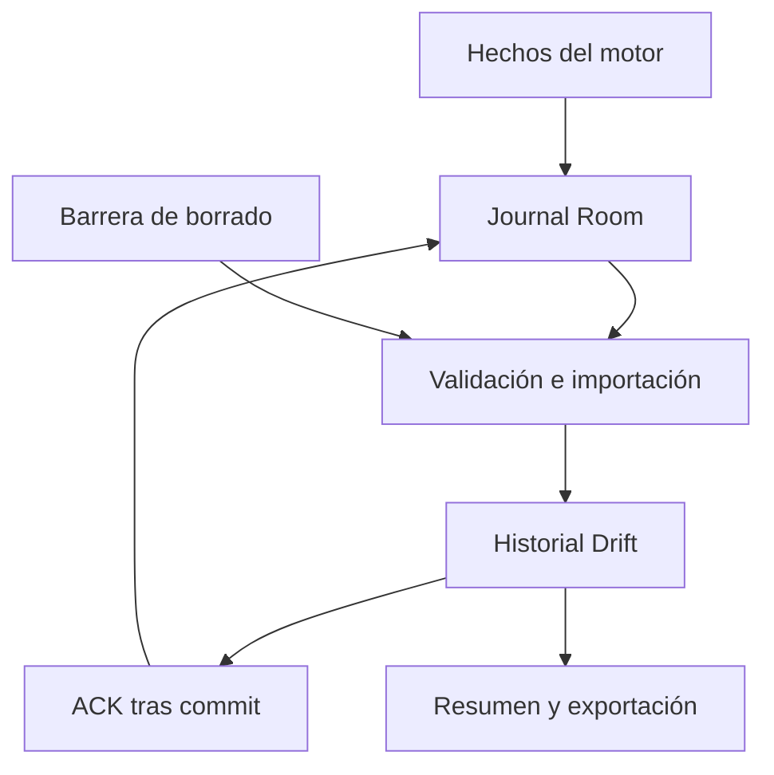

# Vigía · Área 06: modelo de datos y privacidad

Versión 1.0 · 3 de octubre de 2026  
Autor del proyecto: Juan José Rueda Viveros  
Estado: especificación de datos para implementación posterior. SQL de referencia, contratos y pruebas previstas; no constituye una aplicación Android implementada ni una declaración de cumplimiento legal.

## 1. Alcance y documentos vigentes

Fuentes internas consultadas en su estado actual: PRD v1.1, UX v1.0, Área04 arquitectura v1.0 y Área05 IA v1.0. Esta área concreta almacenamiento, integridad, migraciones, JSON/CSV, retención, borrado y backups. Mantiene RF21–RF31 y las restricciones de sesión vigente. Los parámetros IA siguen experimentales; el esquema los conserva con sus versiones, sin aceptarlos por almacenarlos.

No se crea todavía el repositorio ni código de la app. Los dos bloques SQL son referencias verificables para traducir después a entidades Room, tablas Drift y migraciones. No se modifica el PRD ni el prototipo de Claude Design.

Versiones independientes: historyDbVersion=1, journalDbVersion=1, journalPayloadVersion=1, exportSchemaVersion=1. No confundirlas con policyVersion, modelVersion, calibrationConfigVersion ni schemaVersion del canal. Una actualización visual no cambia automáticamente todas estas versiones.

## 2. Qué datos existen y dónde

| Dato | Autoridad | Copia / uso | Retención y salida |
|---|---|---|---|
| Imagen de cámara y landmarks completos | RAM del motor | Inferencia/preview transitorios | No se persisten ni exportan en V1 |
| Calibración numérica aceptada | Kotlin/Room | Copia de lectura Drift; instantánea por sesión | Borrar todo elimina; JSON de sesión contiene su instantánea |
| Sesión y decisiones | Coordinador nativo | Journal Room → historial Drift | Retención de sesiones cerradas; exportación explícita |
| Intervalos y checkpoints | Motor nativo | Spans consolidados Drift | Parte de sesión, cascada en borrado |
| Episodio y cambios de categoría | Política nativa | Historial/detalle/exportación | No son diagnósticos ni cada sonido |
| Intentos de aviso | AlertDispatcher | Resultado técnico en historial | No prueban audibilidad del conductor |
| Valoración | Dominio Dart/Drift | Código retrospectivo | No modifica política ni entrenamiento |
| Tema/sonido/retención | Drift | Configuración enviada al motor cuando corresponde | Persisten; tema puede conservarse al borrar todo |
| Alias actual opcional | Drift | Solo perfil local | No se copia a cada sesión ni se incluye en exportación V1 |
| Marcadores de importación/borrado | Ambos almacenes | Integridad y barrera de restauración | Metadatos técnicos mínimos, sin datos faciales/alias |
| Exportaciones | Destino elegido por usuario | Copias fuera de la app | No se borran automáticamente con el historial |

Excluir alias de exportación V1 es una decisión de minimización; el PRD no exige asociarlo a sesiones. No añadir silenciosamente una casilla nueva a P15. Las valoraciones tienen tres códigos previstos, sin campo de comentario libre. Si se incorpora texto libre después, se versionará dato, UI y exportación.

No cuenta, GPS, contactos, micrófono, fotos, video ni envío automático a empresa/familia. Investigación con video tiene protocolo separado del Área05 y nunca reutiliza este almacenamiento de producto sin autorización explícita.

## 3. Autoridad y relación entre bases

Room guarda hechos nativos, estado mínimo de recuperación, referencias y operaciones. Drift guarda la proyección consultable y los datos propios de producto. No hay consultas Dart directas a tablas Room ni una transacción atómica entre las dos bases.



La UI actual puede conocer un cierre confirmado en memoria aunque haya fallado su escritura. Ese snapshot no sustituye un cierre durable del historial. Si se pierde la memoria sin commit, al reabrir se presenta el extremo como desconocido/interrumpido. Mientras exista un cierre o pérdida de journal sin resolver, bloquear un nuevo inicio para evitar reemplazar evidencia pendiente con otra sesión.

## 4. Convenciones de tipos y tiempo

| Tipo | Representación y validación |
|---|---|
| ID | UUID canónico minúsculo con guiones; TEXT NOT NULL, nunca se reutiliza |
| Fecha persistida | Epoch UTC en ms INTEGER; offset de presentación y zoneId conservados |
| Fecha exportada | ISO8601 con offset, por ejemplo 2026-10-03T18:00:00.000-05:00 |
| Offset/duración | INTEGER ms monotónicos relativos al inicio confirmado; ≥0 |
| Nanosegundos internos | Long nativo; si pasan a JSON, cadena decimal para no perder precisión |
| Booleano SQL | INTEGER 0/1, con CHECK |
| Ratio/geométrico | REAL/double finito; ratio cerrado/coverage dentro de [0,1] cuando aplicable |
| Código/versión | Enum o [A-Za-z0-9][A-Za-z0-9_.-]{0,63}; versionado |
| Hash | SHA-256, 64 caracteres hexadecimales minúsculos |
| JSON interno | TEXT UTF-8 validado en dominio; sin NaN/Infinity/clave duplicada |
| Ausente/desconocido | NULL, nunca 0, cadena vacía ni fecha de reapertura |

SQLite no garantiza por sí solo validación de UUID, zona IANA, JSON o todos los invariantes de negocio. Validar en DTO/repositorio además de CHECK/FK. No depender de JSON1/STRICT sin verificar el SQLite empaquetado/Android elegido. Las referencias SQL usan funciones básicas y no requieren JSON1.

Fechas civiles pueden retroceder si cambia el reloj: no imponer endedEpochMs≥startedEpochMs como duración. Las comparaciones de duración utilizan endOffsetMs≥0. La aclaración concreta “final≥inicio” del Área04 se aplica a offsets del mismo reloj, no a dos fechas civiles tras un ajuste.

En historial, ordenar por startedEpochMs DESC, sessionId DESC para desempate. En tendencias y retención convertir el inicio al rango de fechas de la zona fijada para la operación. No reescribir fechas originales al cambiar de zona.

## 5. Modelo relacional del historial

| Entidad | Clave / relación | Regla |
|---|---|---|
| data_contexts | datasetId PK | Un contexto activo; antiguos retirados solo como barrera |
| sessions | sessionId PK; datasetId FK | Se crea al importar sessionStarted, no al entrar a preparación |
| session_intervals | intervalId PK; sessionId FK | Partición sin solapamientos; una pausa es un intervalo kind=paused |
| episodes | episodeId PK; sessionId FK | Decisión y observación tienen offsets diferentes |
| episode_transitions | transitionId PK; episodeId FK | Cambios de señal en el mismo episodio |
| alert_playbacks | playbackId PK; episodeId FK | Intento sonoro; ordinal único por episodio |
| episode_feedback | episodeId PK/FK | Máximo una valoración actual; padre finalized |
| calibrations | calibrationId PK; datasetId FK | Copia de referencia nativa; no se edita desde Dart |
| preferences | fila singleton | Alias actual, tema, patrón, retención y explicación vista |
| imported_records | recordId PK | Un hash por hecho; incluye su estado aplicado/descartado por borrado |
| deletion_operations | operationId PK | Alcance exacto, etapa/error y reset pendiente |
| deletion_targets | operationId+sessionId PK | Congela alcance; no FK hacia sesión borrable |
| deletion_tombstones | datasetId+scopeId PK | sessionId o * para dataset retirado; nunca contiene payload facial |
| export_operations / export_files | exportId PK; archivo por tipo | Selección congelada y resultado por archivo |

No FK de sessions.calibrationId a una referencia mutable: la sesión guarda calibrationSnapshotJson y su hash inmutables. Así, renovar/eliminar una referencia actual no cambia una sesión anterior. Modelo/política/calibración se identifican por versiones y contenido, no por una preferencia que pueda cambiar.

Las relaciones de datos de una sesión tienen ON DELETE CASCADE. Barreras/operaciones no tienen cascada hacia sessions: deben sobrevivir precisamente al borrado de esa fila.

## 6. SQL de referencia: Drift/historyDbVersion=1

Activar y comprobar foreign_keys en cada conexión; SQLite requiere que su enforcement esté habilitado [S1]. Room/Drift se configuran y prueban por separado. El estado de operaciones y los timestamps de cambios deben actualizarse en la misma transacción de sus efectos.

```sql
-- HISTORY_SCHEMA_V1
PRAGMA foreign_keys = ON;

CREATE TABLE data_contexts (
 dataset_id TEXT PRIMARY KEY NOT NULL,
 status TEXT NOT NULL CHECK(status IN ('active','retired'))
);
CREATE UNIQUE INDEX one_active_dataset ON data_contexts(status) WHERE status='active';

CREATE TABLE preferences (
 singleton INTEGER PRIMARY KEY CHECK(singleton=1),
 theme TEXT NOT NULL CHECK(theme IN ('system','light','dark')),
 sound_pattern_id TEXT NOT NULL,
 retention_days INTEGER CHECK(retention_days IS NULL OR retention_days IN (30,90,180)),
 alias TEXT CHECK(alias IS NULL OR length(alias)<=40),
 explanation_version TEXT,
 updated_epoch_ms INTEGER NOT NULL
);

CREATE TABLE sessions (
 session_id TEXT PRIMARY KEY NOT NULL,
 dataset_id TEXT NOT NULL REFERENCES data_contexts(dataset_id),
 engine_instance_id TEXT NOT NULL,
 started_epoch_ms INTEGER NOT NULL,
 start_zone_id TEXT NOT NULL,
 start_offset_minutes INTEGER NOT NULL CHECK(start_offset_minutes BETWEEN -840 AND 840),
 lifecycle TEXT NOT NULL CHECK(lifecycle IN ('active','paused','stopping','finalized','interrupted')),
 ended_epoch_ms INTEGER,
 end_zone_id TEXT,
 end_offset_minutes INTEGER CHECK(end_offset_minutes IS NULL OR end_offset_minutes BETWEEN -840 AND 840),
 end_offset_ms INTEGER CHECK(end_offset_ms IS NULL OR end_offset_ms>=0),
 latest_durable_offset_ms INTEGER NOT NULL CHECK(latest_durable_offset_ms>=0),
 model_id TEXT NOT NULL,
 model_version TEXT NOT NULL,
 model_sha256 TEXT NOT NULL CHECK(length(model_sha256)=64 AND model_sha256 NOT GLOB '*[^0-9a-f]*'),
 policy_version TEXT NOT NULL,
 policy_sha256 TEXT NOT NULL CHECK(length(policy_sha256)=64 AND policy_sha256 NOT GLOB '*[^0-9a-f]*'),
 policy_snapshot_json TEXT NOT NULL,
 quality_version TEXT NOT NULL,
 calibration_id TEXT NOT NULL,
 calibration_version TEXT NOT NULL,
 calibration_snapshot_json TEXT NOT NULL,
 calibration_snapshot_sha256 TEXT NOT NULL CHECK(length(calibration_snapshot_sha256)=64 AND calibration_snapshot_sha256 NOT GLOB '*[^0-9a-f]*'),
 integrity_status TEXT NOT NULL CHECK(integrity_status IN ('complete','incomplete')),
 consolidation_status TEXT NOT NULL CHECK(consolidation_status IN ('pending','complete','error')),
 last_applied_sequence INTEGER NOT NULL CHECK(last_applied_sequence>=0),
 terminal_high_watermark INTEGER CHECK(terminal_high_watermark IS NULL OR terminal_high_watermark>=0),
 CHECK((ended_epoch_ms IS NULL AND end_zone_id IS NULL AND end_offset_minutes IS NULL) OR
       (ended_epoch_ms IS NOT NULL AND end_zone_id IS NOT NULL AND end_offset_minutes IS NOT NULL)),
 CHECK(end_offset_ms IS NULL OR latest_durable_offset_ms<=end_offset_ms)
);
CREATE INDEX sessions_by_start ON sessions(started_epoch_ms DESC,session_id DESC);
CREATE INDEX sessions_by_policy ON sessions(policy_version,started_epoch_ms);
CREATE INDEX sessions_by_dataset ON sessions(dataset_id);

CREATE TABLE session_intervals (
 interval_id TEXT PRIMARY KEY NOT NULL,
 session_id TEXT NOT NULL REFERENCES sessions(session_id) ON DELETE CASCADE,
 kind TEXT NOT NULL CHECK(kind IN ('evaluable','nonEvaluable','paused','unknown')),
 start_offset_ms INTEGER NOT NULL CHECK(start_offset_ms>=0),
 end_offset_ms INTEGER,
 known_through_offset_ms INTEGER NOT NULL,
 reason_code TEXT,
 CHECK(known_through_offset_ms>=start_offset_ms),
 CHECK(end_offset_ms IS NULL OR end_offset_ms>=known_through_offset_ms)
);
CREATE INDEX intervals_by_session ON session_intervals(session_id,start_offset_ms,interval_id);
CREATE UNIQUE INDEX one_open_interval ON session_intervals(session_id) WHERE end_offset_ms IS NULL;

CREATE TABLE episodes (
 episode_id TEXT PRIMARY KEY NOT NULL,
 session_id TEXT NOT NULL REFERENCES sessions(session_id) ON DELETE CASCADE,
 measurement_segment_id TEXT NOT NULL,
 detected_epoch_ms INTEGER NOT NULL,
 detected_offset_minutes INTEGER NOT NULL CHECK(detected_offset_minutes BETWEEN -840 AND 840),
 decision_offset_ms INTEGER NOT NULL CHECK(decision_offset_ms>=0),
 observed_from_offset_ms INTEGER NOT NULL CHECK(observed_from_offset_ms>=0),
 observed_through_offset_ms INTEGER NOT NULL,
 signal_end_offset_ms INTEGER,
 end_reason TEXT CHECK(end_reason IS NULL OR end_reason IN ('normal','observationLost','paused','sessionStopped','processInterrupted')),
 initial_category TEXT NOT NULL CHECK(initial_category IN ('warning','prolongedEyeClosure')),
 max_category TEXT NOT NULL CHECK(max_category IN ('warning','prolongedEyeClosure')),
 reason_code TEXT NOT NULL,
 measurement_at_detection TEXT NOT NULL CHECK(measurement_at_detection='usable'),
 evidence_json TEXT NOT NULL,
 evidence_schema_version INTEGER NOT NULL CHECK(evidence_schema_version=1),
 integrity_status TEXT NOT NULL CHECK(integrity_status IN ('complete','incomplete')),
 record_revision INTEGER NOT NULL CHECK(record_revision>=1),
 last_applied_sequence INTEGER NOT NULL CHECK(last_applied_sequence>=0),
 CHECK(observed_through_offset_ms>=observed_from_offset_ms),
 CHECK(signal_end_offset_ms IS NULL OR signal_end_offset_ms>=decision_offset_ms),
 CHECK((end_reason IS NOT NULL AND end_reason='normal' AND signal_end_offset_ms IS NOT NULL) OR
       (end_reason IS NULL AND signal_end_offset_ms IS NULL) OR
       (end_reason IS NOT NULL AND end_reason IN ('observationLost','paused','sessionStopped','processInterrupted') AND signal_end_offset_ms IS NULL)),
 CHECK(initial_category!='prolongedEyeClosure' OR max_category='prolongedEyeClosure')
);
CREATE INDEX episodes_by_session ON episodes(session_id,decision_offset_ms,episode_id);

CREATE TABLE episode_transitions (
 transition_id TEXT PRIMARY KEY NOT NULL,
 episode_id TEXT NOT NULL REFERENCES episodes(episode_id) ON DELETE CASCADE,
 ordinal INTEGER NOT NULL CHECK(ordinal>=1),
 decision_offset_ms INTEGER NOT NULL CHECK(decision_offset_ms>=0),
 category TEXT NOT NULL CHECK(category IN ('warning','prolongedEyeClosure','noPersistentSignals')),
 reason_code TEXT NOT NULL,
 UNIQUE(episode_id,ordinal)
);

CREATE TABLE alert_playbacks (
 playback_id TEXT PRIMARY KEY NOT NULL,
 episode_id TEXT NOT NULL REFERENCES episodes(episode_id) ON DELETE CASCADE,
 ordinal INTEGER NOT NULL CHECK(ordinal>=1),
 category TEXT NOT NULL CHECK(category IN ('warning','prolongedEyeClosure')),
 pattern_id TEXT NOT NULL,
 decision_offset_ms INTEGER NOT NULL CHECK(decision_offset_ms>=0),
 requested_offset_ms INTEGER NOT NULL,
 started_offset_ms INTEGER,
 finished_offset_ms INTEGER,
 status TEXT NOT NULL CHECK(status IN ('pending','started','completed','failed','canceled','unknown')),
 error_code TEXT,
 record_revision INTEGER NOT NULL CHECK(record_revision>=1),
 last_applied_sequence INTEGER NOT NULL CHECK(last_applied_sequence>=1),
 UNIQUE(episode_id,ordinal),
 CHECK(requested_offset_ms>=decision_offset_ms),
 CHECK(started_offset_ms IS NULL OR started_offset_ms>=requested_offset_ms),
 CHECK(finished_offset_ms IS NULL OR finished_offset_ms>=COALESCE(started_offset_ms,requested_offset_ms)),
 CHECK(status NOT IN ('started','completed') OR started_offset_ms IS NOT NULL),
 CHECK(status!='completed' OR finished_offset_ms IS NOT NULL),
 CHECK(status!='failed' OR error_code IS NOT NULL)
);

CREATE TABLE episode_feedback (
 episode_id TEXT PRIMARY KEY NOT NULL REFERENCES episodes(episode_id) ON DELETE CASCADE,
 code TEXT NOT NULL CHECK(code IN ('useful','notPerceived','unsure')),
 updated_epoch_ms INTEGER NOT NULL,
 updated_offset_minutes INTEGER NOT NULL CHECK(updated_offset_minutes BETWEEN -840 AND 840)
);

CREATE TABLE calibrations (
 calibration_id TEXT PRIMARY KEY NOT NULL,
 dataset_id TEXT NOT NULL REFERENCES data_contexts(dataset_id),
 created_epoch_ms INTEGER NOT NULL,
 model_sha256 TEXT NOT NULL,
 calibration_version TEXT NOT NULL,
 mount_revision INTEGER NOT NULL CHECK(mount_revision>=0),
 applicable INTEGER NOT NULL CHECK(applicable IN (0,1)),
 snapshot_json TEXT NOT NULL,
 snapshot_sha256 TEXT NOT NULL CHECK(length(snapshot_sha256)=64 AND snapshot_sha256 NOT GLOB '*[^0-9a-f]*')
);

CREATE TABLE imported_records (
 record_id TEXT PRIMARY KEY NOT NULL,
 dataset_id TEXT NOT NULL,
 session_id TEXT,
 journal_sequence INTEGER NOT NULL CHECK(journal_sequence>=1),
 payload_hash TEXT NOT NULL CHECK(length(payload_hash)=64 AND payload_hash NOT GLOB '*[^0-9a-f]*'),
 disposition TEXT NOT NULL CHECK(disposition IN ('applied','discardedDeleted')),
 imported_epoch_ms INTEGER NOT NULL,
 UNIQUE(dataset_id,journal_sequence)
);
CREATE INDEX imported_by_session ON imported_records(dataset_id,session_id);

CREATE TABLE deletion_operations (
 operation_id TEXT PRIMARY KEY NOT NULL,
 dataset_id TEXT NOT NULL,
 scope TEXT NOT NULL CHECK(scope IN ('sessions','retention','datasetReset')),
 stage TEXT NOT NULL CHECK(stage IN ('intentSaved','nativeDeleted','localDeleted','contextReset','complete')),
 status TEXT NOT NULL CHECK(status IN ('pending','error','complete')),
 requested_epoch_ms INTEGER NOT NULL,
 cutoff_epoch_ms INTEGER,
 cutoff_zone_id TEXT,
 requested_retention_days INTEGER CHECK(requested_retention_days IS NULL OR requested_retention_days IN (30,90,180)),
 new_dataset_id TEXT,
 last_error_code TEXT,
 updated_epoch_ms INTEGER NOT NULL,
 CHECK(status!='complete' OR stage='complete')
);
CREATE TABLE deletion_targets (
 operation_id TEXT NOT NULL REFERENCES deletion_operations(operation_id) ON DELETE CASCADE,
 session_id TEXT NOT NULL,
 PRIMARY KEY(operation_id,session_id)
);
CREATE TABLE deletion_tombstones (
 dataset_id TEXT NOT NULL,
 scope_id TEXT NOT NULL,
 PRIMARY KEY(dataset_id,scope_id)
);

CREATE TABLE export_operations (
 export_id TEXT PRIMARY KEY NOT NULL,
 dataset_id TEXT NOT NULL,
 format TEXT NOT NULL CHECK(format IN ('json','csv')),
 status TEXT NOT NULL CHECK(status IN ('pending','partial','complete','canceled','failed','invalidated','expired')),
 exported_epoch_ms INTEGER NOT NULL,
 exported_offset_minutes INTEGER NOT NULL CHECK(exported_offset_minutes BETWEEN -840 AND 840),
 zone_id TEXT NOT NULL,
 selection_json TEXT NOT NULL,
 snapshot_relative_path TEXT,
 snapshot_sha256 TEXT,
 expires_epoch_ms INTEGER NOT NULL,
 CHECK(expires_epoch_ms>exported_epoch_ms)
);
CREATE TABLE export_files (
 export_id TEXT NOT NULL REFERENCES export_operations(export_id) ON DELETE CASCADE,
 file_kind TEXT NOT NULL CHECK(file_kind IN ('json','sessionsCsv','episodesCsv')),
 status TEXT NOT NULL CHECK(status IN ('pending','written','canceled','failed','unknown')),
 byte_count INTEGER CHECK(byte_count IS NULL OR byte_count>=0),
 sha256 TEXT,
 last_error_code TEXT,
 PRIMARY KEY(export_id,file_kind)
);

CREATE TRIGGER intervals_no_overlap_insert BEFORE INSERT ON session_intervals
WHEN EXISTS(SELECT 1 FROM session_intervals i WHERE i.session_id=NEW.session_id
 AND NEW.start_offset_ms<COALESCE(i.end_offset_ms,9223372036854775807)
 AND i.start_offset_ms<COALESCE(NEW.end_offset_ms,9223372036854775807))
BEGIN SELECT RAISE(ABORT,'intervalOverlap'); END;
CREATE TRIGGER intervals_no_overlap_update BEFORE UPDATE ON session_intervals
WHEN EXISTS(SELECT 1 FROM session_intervals i WHERE i.session_id=NEW.session_id AND i.interval_id!=OLD.interval_id
 AND NEW.start_offset_ms<COALESCE(i.end_offset_ms,9223372036854775807)
 AND i.start_offset_ms<COALESCE(NEW.end_offset_ms,9223372036854775807))
BEGIN SELECT RAISE(ABORT,'intervalOverlap'); END;

CREATE TRIGGER session_snapshot_immutable BEFORE UPDATE ON sessions
WHEN NEW.session_id IS NOT OLD.session_id OR NEW.dataset_id IS NOT OLD.dataset_id
 OR NEW.engine_instance_id IS NOT OLD.engine_instance_id OR NEW.started_epoch_ms IS NOT OLD.started_epoch_ms
 OR NEW.start_zone_id IS NOT OLD.start_zone_id OR NEW.start_offset_minutes IS NOT OLD.start_offset_minutes
 OR NEW.model_id IS NOT OLD.model_id OR NEW.model_version IS NOT OLD.model_version
 OR NEW.model_sha256 IS NOT OLD.model_sha256 OR NEW.policy_version IS NOT OLD.policy_version
 OR NEW.policy_sha256 IS NOT OLD.policy_sha256 OR NEW.policy_snapshot_json IS NOT OLD.policy_snapshot_json
 OR NEW.quality_version IS NOT OLD.quality_version OR NEW.calibration_id IS NOT OLD.calibration_id
 OR NEW.calibration_version IS NOT OLD.calibration_version
 OR NEW.calibration_snapshot_json IS NOT OLD.calibration_snapshot_json
 OR NEW.calibration_snapshot_sha256 IS NOT OLD.calibration_snapshot_sha256
BEGIN SELECT RAISE(ABORT,'immutableSessionSnapshot'); END;

CREATE TRIGGER feedback_finalized_insert BEFORE INSERT ON episode_feedback
WHEN (SELECT s.lifecycle FROM sessions s JOIN episodes e ON e.session_id=s.session_id WHERE e.episode_id=NEW.episode_id)!='finalized'
BEGIN SELECT RAISE(ABORT,'feedbackRequiresFinalized'); END;
CREATE TRIGGER feedback_finalized_update BEFORE UPDATE ON episode_feedback
WHEN (SELECT s.lifecycle FROM sessions s JOIN episodes e ON e.session_id=s.session_id WHERE e.episode_id=NEW.episode_id)!='finalized'
BEGIN SELECT RAISE(ABORT,'feedbackRequiresFinalized'); END;
```

SQL no sustituye estos controles de repositorio: lifecycle terminal no vuelve a active; latestDurableOffset y lastAppliedSequence no retroceden; maxCategory solo escala; fin confirmado requiere evento terminal válido. Una sesión complete exige todos sus intervalos cerrados y partición completa hasta endOffset; no permitir marcarla complete solo porque no hubo excepción SQL.

Validar UUID/hash/modelSha también en calibrations y DTO antes de escribir. Los checks mostrados para campos principales no implican que todos los campos TEXT admitan contenido arbitrario.

## 7. SQL de referencia: Room/journalDbVersion=1

Estado operativo nativo y outbox usan la misma transacción para una transición durable. La preparación no es sesión; los intentos fallidos quedan nativos lifecycle=failed sin convertirse en sesiones de historial/exportación. No cuentan como tiempo de monitoreo.

```sql
-- JOURNAL_SCHEMA_V1
PRAGMA foreign_keys = ON;
CREATE TABLE n_contexts (
 dataset_id TEXT PRIMARY KEY NOT NULL,
 status TEXT NOT NULL CHECK(status IN ('active','retired'))
);
CREATE UNIQUE INDEX n_one_active_dataset ON n_contexts(status) WHERE status='active';

CREATE TABLE n_sessions (
 session_id TEXT PRIMARY KEY NOT NULL,
 dataset_id TEXT NOT NULL REFERENCES n_contexts(dataset_id),
 engine_instance_id TEXT NOT NULL,
 lifecycle TEXT NOT NULL CHECK(lifecycle IN ('starting','active','paused','stopping','finalized','interrupted','failed')),
 attempted_epoch_ms INTEGER NOT NULL,
 started_epoch_ms INTEGER,
 latest_durable_offset_ms INTEGER NOT NULL CHECK(latest_durable_offset_ms>=0),
 end_offset_ms INTEGER CHECK(end_offset_ms IS NULL OR end_offset_ms>=latest_durable_offset_ms),
 metadata_json TEXT NOT NULL,
 last_record_sequence INTEGER NOT NULL CHECK(last_record_sequence>=0),
 CHECK(lifecycle IN ('starting','failed') OR started_epoch_ms IS NOT NULL)
);
CREATE UNIQUE INDEX n_one_current_session ON n_sessions((1))
 WHERE lifecycle IN ('starting','active','paused','stopping');

CREATE TABLE n_calibrations (
 calibration_id TEXT PRIMARY KEY NOT NULL,
 dataset_id TEXT NOT NULL REFERENCES n_contexts(dataset_id),
 mount_revision INTEGER NOT NULL CHECK(mount_revision>=0),
 applicable INTEGER NOT NULL CHECK(applicable IN (0,1)),
 snapshot_json TEXT NOT NULL,
 snapshot_sha256 TEXT NOT NULL CHECK(length(snapshot_sha256)=64 AND snapshot_sha256 NOT GLOB '*[^0-9a-f]*')
);
CREATE TABLE n_outbox (
 journal_sequence INTEGER PRIMARY KEY AUTOINCREMENT,
 record_id TEXT NOT NULL UNIQUE,
 dataset_id TEXT NOT NULL,
 session_id TEXT,
 record_type TEXT NOT NULL,
 occurred_epoch_ms INTEGER NOT NULL,
 occurred_offset_minutes INTEGER NOT NULL CHECK(occurred_offset_minutes BETWEEN -840 AND 840),
 session_offset_ms INTEGER CHECK(session_offset_ms IS NULL OR session_offset_ms>=0),
 payload_schema_version INTEGER NOT NULL CHECK(payload_schema_version=1),
 payload_json TEXT NOT NULL,
 payload_hash TEXT NOT NULL CHECK(length(payload_hash)=64 AND payload_hash NOT GLOB '*[^0-9a-f]*'),
 ack_state TEXT NOT NULL CHECK(ack_state IN ('pending','acked'))
);
CREATE INDEX n_pending_records ON n_outbox(ack_state,journal_sequence);
CREATE INDEX n_records_by_session ON n_outbox(dataset_id,session_id);

CREATE TABLE n_commands (
 command_id TEXT PRIMARY KEY NOT NULL,
 dataset_id TEXT NOT NULL,
 session_id TEXT,
 command_type TEXT NOT NULL,
 request_hash TEXT NOT NULL,
 status TEXT NOT NULL CHECK(status IN ('pending','succeeded','rejected','failed')),
 result_json TEXT NOT NULL
);
CREATE TABLE n_batches (
 batch_id TEXT PRIMARY KEY NOT NULL,
 dataset_id TEXT NOT NULL,
 high_watermark INTEGER NOT NULL CHECK(high_watermark>=0),
 expires_epoch_ms INTEGER NOT NULL
);
CREATE TABLE n_batch_records (
 batch_id TEXT NOT NULL REFERENCES n_batches(batch_id) ON DELETE CASCADE,
 record_id TEXT NOT NULL,
 payload_hash TEXT NOT NULL,
 PRIMARY KEY(batch_id,record_id)
);
CREATE TABLE n_sequence_dispositions (
 first_sequence INTEGER NOT NULL CHECK(first_sequence>=1),
 last_sequence INTEGER NOT NULL CHECK(last_sequence>=first_sequence),
 reason TEXT NOT NULL CHECK(reason IN ('acked','deleted','otherDataset')),
 operation_id TEXT,
 PRIMARY KEY(first_sequence,last_sequence)
);
CREATE TABLE n_deletions (
 operation_id TEXT PRIMARY KEY NOT NULL,
 dataset_id TEXT NOT NULL,
 scope TEXT NOT NULL CHECK(scope IN ('sessions','retention','datasetReset')),
 scope_hash TEXT NOT NULL,
 status TEXT NOT NULL CHECK(status IN ('pending','deleted','complete')),
 new_dataset_id TEXT
);
CREATE TABLE n_deletion_targets (
 operation_id TEXT NOT NULL REFERENCES n_deletions(operation_id) ON DELETE CASCADE,
 session_id TEXT NOT NULL,
 PRIMARY KEY(operation_id,session_id)
);
CREATE TABLE n_tombstones (
 dataset_id TEXT NOT NULL,
 scope_id TEXT NOT NULL,
 PRIMARY KEY(dataset_id,scope_id)
);
CREATE TRIGGER n_outbox_content_immutable BEFORE UPDATE ON n_outbox
WHEN NEW.journal_sequence IS NOT OLD.journal_sequence OR NEW.record_id IS NOT OLD.record_id
 OR NEW.dataset_id IS NOT OLD.dataset_id OR NEW.session_id IS NOT OLD.session_id
 OR NEW.record_type IS NOT OLD.record_type OR NEW.occurred_epoch_ms IS NOT OLD.occurred_epoch_ms
 OR NEW.occurred_offset_minutes IS NOT OLD.occurred_offset_minutes
 OR NEW.session_offset_ms IS NOT OLD.session_offset_ms OR NEW.payload_schema_version IS NOT OLD.payload_schema_version
 OR NEW.payload_json IS NOT OLD.payload_json OR NEW.payload_hash IS NOT OLD.payload_hash
BEGIN SELECT RAISE(ABORT,'immutableJournalRecord'); END;
```

No FK de outbox a n_sessions: pueden existir hechos de calibración o un lote bajo borrado; su limpieza se ejecuta explícitamente por alcance. El materializado n_sessions no duplica series por frame. metadataJson contiene el SessionMetadataV1 de sección 9.

Límite de lote: 100 registros y 1 MiB serializado, lo que ocurra primero. Ningún registro excede 64 KiB; rechazo de registro sobredimensionado produce registro incompleto y error tipado, no truncamiento silencioso. Reducir el lote no reordena sus hechos.

Buffer temporal después de fallo de journal: máximo 256 registros o 1 MiB, lo que ocurra primero, versión buffer-v1. No es durable. Al agotarse, contar descartes y conservar resumen de pérdida por sesión con primer/último offset conocido y tipos afectados; alertas no dependen de la escritura. Cuando vuelve almacenamiento, persistir recordLossSummary y los hechos recuperables; no reconstruir episodios perdidos. Esta decisión cierra el límite numérico pendiente de Área04 y necesita ensayo de agotamiento/rendimiento.

## 8. Integridad, canonicalización y hechos

Para journal y snapshots, usar JCS/RFC8785 y SHA-256 de sus bytes UTF-8 [S2]. No basta json.dumps(sort_keys=True) para declarar conformidad: orden de claves, números y Unicode tienen reglas específicas. Fijar implementación compatible Dart/Kotlin y vectors de conformidad antes del plugin.

Envelope protegido por hash para detectar cambios, sin firma ni autenticación: schemaVersion, recordId, datasetId, journalSequence, sessionId, recordType, occurredAt con offset, sessionOffsetMs, payloadSchemaVersion y payload. payloadHash se calcula sobre ese objeto sin el campo payloadHash. No añadir ackState/batchId al hash: son transporte mutable. JSON público puede tener indentación distinta; el hash usa canonicalización.

Números enteros de JSON≤2^53−1 en valor absoluto; nanosegundos/contadores fuera de ese rango se serializan como cadenas decimales tipadas. Prohibir NaN/Infinity, strings Unicode malformados y claves duplicadas. JCS no normaliza Unicode: NFC se aplica únicamente donde lo exige dominio, como alias, antes de construir el dato.

Tipos de hecho v1 y payload obligatorio:

| recordType | Payload mínimo |
|---|---|
| sessionStartAttempt / sessionStartFailed | candidateSessionId, commandId, attemptedAt, cause en fallo; no tiempo de sesión |
| sessionStarted | SessionMetadataV1, interval inicial no evaluable, ID/offset de inicio |
| intervalOpened | intervalId, kind, startOffsetMs, reasonCode |
| progressCheckpoint | intervalId, knownThroughOffsetMs, latestDurableOffsetMs, estado/segmento |
| intervalClosed | intervalId, endOffsetMs y knownThroughOffsetMs |
| episodeOpened | EpisodeV1 con decisión, evidencia, observación e ID de segmento |
| episodeUpdated | episodeId, revisión, observedThroughOffsetMs, maxCategory, transitions/playbacks nuevos identificados |
| episodeClosed | episodeId, endReason, signalEndOffsetMs nullable, observedThroughOffsetMs |
| playbackResult | PlaybackV1 por ID; nueva revisión de intento, sin episodio nuevo |
| sessionFinalized | sessionId, endOffsetMs, endedAt/zona, highWatermark e integridad |
| interruptionRecovered | sessionId, última evidencia durable, recoveredAt; fin real null |
| calibrationAccepted | CalibrationSnapshotV1 y hash |
| technicalFailure / recordLossSummary | code, componente, offsets conocidos, recordsDropped y alcance; no diagnóstico |

Los tipos no listados/versiones desconocidas no se omiten con ACK: detener ese lote con schemaUnsupported y mantener pendiente. Descartar por borrado solo exige validar envelope/identidad/hash y barrera; no reintroducir datos para validar relaciones con una sesión ya borrada.

## 9. DTO y validaciones de dominio

SessionMetadataV1: sessionId, datasetId, engineInstanceId, startedAt, startZoneId, startOffsetMinutes, modelId/modelVersion/modelSha256, policyVersion/policySnapshot/policySha256, qualityVersion, calibrationId/calibrationVersion/calibrationSnapshot/calibrationSnapshotSha256. Payloads de calibración/política siguen Área05 y qualificationStatus; nunca se sustituye la instantánea por configuración actual al leer.

CalibrationSnapshotV1 incluye ID, fecha/offset, modelSha, featureSchema, calibrationConfigVersion, mountRevision, openEAR de ambos ojos, pose de referencia, resúmenes de muestras/cobertura/MAD/comprobaciones. Validar finitos y rango de configuración correspondiente. El esquema almacena versiones aceptadas y experimentales sin confundirlas.

EpisodeV1: episodeId, sessionId, measurementSegmentId, detectedAt/offset, decisionOffsetMs, observedFromOffsetMs, observedThroughOffsetMs, signalEndOffsetMs nullable, endReason nullable, initialCategory/maxCategory, reasonCode, measurementAtDetection=usable, evidenceSchemaVersion, evidence y recordRevision. evidence v1 contiene closedRunMsAtDecision nullable, windowClosedRatio nullable, windowDurationMs nullable, ratios oculares compactos y versiones necesarias; no landmarks.

PlaybackV1: playbackId, episodeId, ordinal (entero ≥1), category, patternId, decisionOffsetMs, requestedOffsetMs, startedOffsetMs nullable, finishedOffsetMs nullable, status, errorCode nullable y recordRevision (entero ≥1). Los estados admitidos son exactamente pending/started/completed/failed/canceled/unknown. finished no se rellena al reabrir; failed exige errorCode y no exige started. Un intento se identifica por playbackId aunque llegue una revisión posterior. DTO de fechas usa occurredAt del envelope; los offsets de reproducción permanecen monotónicos.

recordRevision crece por entidad y se conserva en episodes/alert_playbacks junto con lastAppliedSequence. Comparar contra la revisión materializada: menor no sobrescribe; igual con valores de entidad idénticos es no-op; igual con contenido distinto rechaza recordIntegrityFailed; mayor actualiza tras validar transición. Esa comparación excluye recordId, batchId y fecha del envelope. El journal conserva identidades/hash mientras sean importables; V1 aplica estrictamente su orden y no habilita una vía de edición alternativa desde Dart. No confundir revisión de entidad con secuencia global del journal.

decisionOffset identifica cuándo el motor abrió el episodio; observedFrom/Through describen la evidencia de captura. Un frame puede ser anterior a la decisión por latencia: no exigir observedThrough≥decisionOffset. Para fin normal, duración del episodio de app=signalEndOffset−decisionOffset. Con corte/pérdida es null. La evidencia de cierre ocular medida no es esa duración de episodio ni una duración fisiológica certificada.

Feedback: useful/notPerceived/unsure; solo padre finalized. Guardar fecha/offset de cambio sin alterar episodio. Prohibir edición si existe otra sesión vigente o estado incierto mediante guardas de producto, aunque la FK del episodio sea de una sesión vieja.

Alias: Unicode trim → NFC → contar valores escalares ≤40; vacío→NULL. Un emoji compuesto puede ocupar varios valores. Rechazar NUL y controles de línea/tabulación para un alias de una línea. SQLite length complementa, no reemplaza esa normalización. No truncar para guardar.

Tema inicial system; retención inicial 90; soundPatternId se elige de catálogo local aprobado, sin inventar ID de un recurso inexistente. Cambiar patrón invalida prueba de audibilidad de la siguiente sesión. No persistir confirmación humana como un booleano reutilizable entre sesiones.

## 10. Importación, ACK y gaps declarados

1. Suscribir/resolver snapshot según Área04; leer lote nativo ordenado por journalSequence, con highWatermark.
2. Validar envelope/hash/versiones, dataset y barreras. Transacción Drift: insertar importedRecords y aplicar hechos nuevos; ID+hash iguales→no-op, ID/hash distinto→recordIntegrityFailed.
3. Materializar padres antes de hijos según secuencia de hechos. Un hijo sin padre que debió venir en ese lote indica falta de evidencia; no crear una sesión de relleno ni un alias ficticio.
4. Commit Drift. ACK solo de recordId/hash exactos que hicieron commit o se descartaron por barrera durable. Nunca ACK de toda sesión ni de un episodio por su ID.
5. Nativo marca ACK y depura outbox solo tras ese commit/confirmación. Una revisión posterior tiene otro recordId y no se elimina por el ACK anterior.

Gap no declarado → pending/error. journalSequence es global y puede tener huecos por ACK/borrado/otros datasets: acompañar lote de sequenceDispositions, rangos no solapados con razón. Validar ACK contra importedRecords, borrado contra operationId/tombstones y otherDataset contra contexto retirado. No interpretar un salto autorizado como pérdida ni aceptar cualquier salto sin evidencia. Este detalle concreta el manejo de gaps del Área04.

Cursor: highWatermark+posición, ligado a batchId y dataset; lease de lote 60 s propuesta inicial. Si expira, releer y deduplicar. Un ACK tardío solo confirma si ID/hash conservados o existe confirmación durable anterior; no recrea registros depurados. n_batches guarda IDs/hashes, nunca copia payloads personales para prolongar retención.

Mantener recibos importedRecords mientras viva el dataset o el hecho siga importable. Al borrar una sesión retirar recibos personales/IDs de hechos asociados después de confirmar borrado nativo; conservar tombstone de sesión. ACK de lote viejo se resuelve con barrera y ledger nativo. Tras datasetReset purgar recibos y conservar solo barrera * del dataset retirado.

## 11. Resumen, intervalos y consultas

Intervalos usan [inicio,fin): límites contiguos no solapan. Al cerrar uno y abrir otro, ejecutar ambas operaciones en una transacción. Un unknown acotado es un intervalo explícito; un extremo final desconocido no crea un intervalo hasta recoveredAt.

Duración para cálculo provisional de intervalo abierto = knownThrough−start, identificada como prefijo confirmado. Para intervalos cerrados = end−start. No avanzar knownThrough con reloj Flutter ni hasta fecha civil de reapertura. latestDurableOffset indica el último límite confirmado del journal, no todo el estado hasta ahora.

Fórmulas desde la misma consulta/proyección para P07/P09/P11/exportación:

- evaluableMs, nonEvaluableMs, pausedMs, unknownBoundedMs: suma de intervalos respectivos.
- representedKnownMs: suma de esos cuatro valores; si hay cola desconocida se indica hasUnknownTail=true y total de la sesión no se declara definitivo.
- coverageRatio=evaluableMs/(evaluableMs+nonEvaluableMs); denominador0→NULL.
- episodeCount=COUNT(DISTINCT episodeId); warningEpisodeCount cuenta maxCategory=warning y prolongedClosureEpisodeCount cuenta maxCategory=prolongedEyeClosure. Una escalada no se cuenta en ambos totales excluyentes.
- tasa=episodeCount×3600000/evaluableMs; grupos de policyVersion separados.

No sumar duraciones de episodios a duración de sesión ni sumar de nuevo pausas exportadas como proyección. DS01: 600000/120000/180000/60000 →960000 ms y coverage0,833333…; presentación83,3 %. DS02: final desconocido, no duración hasta reapertura. DS03: 2/1800000→4/h y1/600000→6/h, coberturas75/50 separadas. DS04: denominador0→No disponible.

complete: highWatermark terminal reconciliado, ausencia de pérdida conocida, intervalos sin hueco/solapamiento hasta fin confirmado y metadatos obligatorios presentes. pending: hechos/consolidación aún pendientes. incomplete: pérdida declarada, integridad fallida o extremo sin confirmar. En una sesión interrupted la ausencia de fin se representa aunque la importación de su prefijo haya terminado: consolidation=complete no borra integrity=incomplete.

Historial vacío requiere consulta exitosa con cero filas; error no muestra Aún no tienes sesiones. Lista paginada de 50 filas, cursor (startedEpochMs,sessionId), mismo orden; no OFFSET para evitar duplicados al añadir sesiones. Sesiones con inicio confirmado e interrumpidas permanecen visibles. Intentos failed sin inicio no integran estadísticas.

## 12. Borrado, reset y retención

ProductOperationCoordinator Dart serializa importación, snapshot de exportación, inicio y mutaciones de datos. Guardar intención y tombstones antes de tocar el nativo; volver a comprobar ausencia de sesión vigente/estado incierto. Kotlin serializa borrado/inicio y rechaza colisiones. Paused sigue siendo vigente.

| Etapa | Escritura / efecto durable |
|---|---|
| intentSaved | Drift: operationId, dataset, scope/targets exactos, tombstones y fecha/corte confirmados |
| nativeDeleted | Room: validar scopeHash; bloquear captura, borrar n_sessions/outbox/comandos/lotes afectados, guardar barreras/resultado |
| localDeleted | Drift: cascadas y recibos/calibraciones/alias según alcance; invalidar exportaciones internas afectadas |
| contextReset | Solo borrar todo: después de eliminar datos de ambas bases, generar y reconciliar nuevo datasetId |
| complete | Confirmaciones de ambas bases/contexto existen; UI anuncia resultado |

Operación repetida mismo ID y scopeHash devuelve su resultado; payload distinto rechaza. Si intención falla, no borrar nativo. Si una base falla, status=error y etapa alcanzada se conservan; no restaurar desde la otra. La UI indica Eliminación pendiente, bloquea nuevo inicio y permite reintento con el mismo operationId. Cerrar D03/D07 después de comenzar no cancela el borrado.

Sesión/retención: borra episodios, transiciones, avisos, intervalos y feedback; no borrar referencia actual solo porque se borró una sesión que la usó. La instantánea personal dentro de esa sesión sí se elimina. Purga Room de n_commands que incluyan snapshots/datos de esos IDs; no conservar resultJson facial fuera del alcance.

Borrar todo: borrar todas las sesiones y referencias, alias, confirmaciones/preparación y preferencias salvo theme si se conserva; reiniciar retención90 y patrón del catálogo por defecto, versión de explicación vista se conserva. El usuario ya vio la explicación; nueva versión de contenido podrá volver a mostrarla. Marcadores mínimos de dataset retirado sobreviven sin alias/referencia/payload.

Reset concreto: después de nativeDeleted+localDeleted, Drift registra newDatasetId una vez. Añadir commitDatasetReset(operationId,newDatasetId) al contrato del plugin; es idempotente y permitido solo sobre operación deleted de reset. Room retira contexto viejo y activa nuevo en una transacción; Drift hace lo mismo y marca complete. Si cae entre ambos, arranque reconcilia esa operación antes de habilitar preparación. No crear un ID nuevo en cada reintento. Borrado físico de datos precede a esta activación, según Área04.

Retención: N=30/90/180; NULL=Hasta que los borre. Corte en zona elegida para la operación: inicio local de hoy−(N−1) fechas. Seleccionar solo sesiones cerradas cuyo startedEpochMs<corteUTC. Igualdad conserva. D04 muestra zona, corte e IDs/cantidad congelados; si el conjunto cambia antes de ejecutar, recalcular y presentar nueva confirmación. Guardar valor solicitado y operación pendiente de limpieza; no afirmar limpieza completa por guardar preferencia.

Ejecutar al abrir y después de cerrar/consolidar. Si todavía existe sesión vigente/estado incierto, diferir la limpieza hasta resolverlo. Cero candidatos: guardar opción sin borrado. DS08 con hoy01/10/2026 Bogotá y N30: corte02/09/2026 00:00−05:00 =05:00Z.

Tombstones de sesión duran durante el dataset: contienen solo datasetId/sessionId; son barreras técnicas, no anonimización. Reset permite sustituirlas por barrera * del dataset retirado una vez purgados sus datos/lotes. No borrar barreras para reducir conteos sin demostrar que los lotes antiguos ya no pueden entrar.

## 13. Exportación JSON V1

Orden determinista: sesiones por startedAt/sessionId; intervalos por startOffset/intervalId; episodios por decisionOffset/episodeId; transiciones e intentos por ordinal; valoraciones por episodeId. JSON admite indentación, UTF-8 sin BOM, números con punto y null para desconocidos.

| Ruta | Contenido |
|---|---|
| schemaVersion | 1 |
| exportId/exportedAt/zoneId/datasetMode | Identidad, fecha civil, zona y real/demo |
| selection | scope session/all, sessionIds exactos, selectionSnapshotSha256 |
| sessions[] | SessionMetadataV1 + lifecycle/fin/última evidencia, integridad/consolidación y summary derivado |
| intervals[] | Todos los cuatro kind; límites y prefijo conocido |
| pauses[] | Proyección de intervals kind=paused, mismos intervalId; no filas nuevas |
| episodes[] | EpisodeV1; evidencia compacta, extremos desconocidos explícitos |
| episodeTransitions[]/alertPlaybacks[] | Cambios/avisos; no cuentan como episodios |
| feedback[] | Códigos y fechas separados |

JSON incluye parámetros/referencias numéricas de la sesión para interpretación reproducible; no imágenes, landmarks completos, alias, recibos, borrados ni logs. P15 identifica ese contenido y la cantidad de sesiones antes del selector. CSV contiene resúmenes/versiones/hash, no las instantáneas completas.

Un lector de prueba verifica IDs únicos/FK, pausas idénticas a sus intervalos, metadatos y conteos, sin importar a la app. V1 no añade una función pública de importar/restaurar archivos. “Reimportar en la prueba” del PRD significa parser/verificación de exportación.

### Ejemplo de estructura: fixture sintético de 10 segundos

Los hashes de 0/1/2 son valores sintéticos, no evidencia de modelo real ni vectores JCS. Este ejemplo muestra claves y nulls; policySnapshot/calibrationSnapshot se expanden según sus DTO completos en la exportación real.

```json
{
  "schemaVersion": 1,
  "exportId": "70000000-0000-4000-8000-000000000001",
  "exportedAt": "2026-10-03T18:00:10.000-05:00",
  "zoneId": "America/Bogota",
  "datasetMode": "demo",
  "selection": {
    "scope": "session",
    "sessionIds": ["10000000-0000-4000-8000-000000000001"],
    "selectionSnapshotSha256": "0000000000000000000000000000000000000000000000000000000000000000"
  },
  "sessions": [{
    "sessionId": "10000000-0000-4000-8000-000000000001",
    "datasetId": "20000000-0000-4000-8000-000000000001",
    "engineInstanceId": "30000000-0000-4000-8000-000000000001",
    "startedAt": "2026-10-03T18:00:00.000-05:00",
    "startZoneId": "America/Bogota",
    "startOffsetMinutes": -300,
    "lifecycle": "finalized",
    "endedAt": "2026-10-03T18:00:10.000-05:00",
    "endZoneId": "America/Bogota",
    "endOffsetMinutes": -300,
    "endOffsetMs": 10000,
    "latestDurableOffsetMs": 10000,
    "modelId": "demo-model",
    "modelVersion": "demo-v1",
    "modelSha256": "0000000000000000000000000000000000000000000000000000000000000000",
    "policyVersion": "demo-policy-v1",
    "policySha256": "1111111111111111111111111111111111111111111111111111111111111111",
    "policySnapshot": {"profileId": "demo-policy-v1", "qualificationStatus": "experimental"},
    "qualityVersion": "demo-q-v1",
    "calibrationId": "40000000-0000-4000-8000-000000000001",
    "calibrationVersion": "demo-cal-v1",
    "calibrationSnapshot": {"calibrationId": "40000000-0000-4000-8000-000000000001", "openEAR_R": 0.3, "openEAR_L": 0.3},
    "calibrationSnapshotSha256": "2222222222222222222222222222222222222222222222222222222222222222",
    "integrityStatus": "complete",
    "consolidationStatus": "complete",
    "summary": {
      "evaluableMs": 10000, "nonEvaluableMs": 0, "pausedMs": 0,
      "unknownBoundedMs": 0, "representedKnownMs": 10000,
      "hasUnknownTail": false, "coverageRatio": 1.0,
      "episodeCount": 0, "warningEpisodeCount": 0,
      "prolongedClosureEpisodeCount": 0, "playbackAttemptCount": 0
    }
  }],
  "intervals": [{
    "intervalId": "50000000-0000-4000-8000-000000000001",
    "sessionId": "10000000-0000-4000-8000-000000000001",
    "kind": "evaluable", "startOffsetMs": 0,
    "endOffsetMs": 10000, "knownThroughOffsetMs": 10000, "reasonCode": null
  }],
  "pauses": [], "episodes": [], "episodeTransitions": [], "alertPlaybacks": [], "feedback": []
}
```

## 14. CSV V1: dos archivos y columnas exactas

Perfil csv-v1: UTF-8 sin BOM, separador coma, registro CRLF, header obligatorio; campo con coma/comillas/CR/LF entre comillas dobles y comillas internas duplicadas [S3]. Todas las filas tienen el mismo número de columnas. Códigos en inglés del contrato, texto de UI español fuera del archivo.

INTEGER decimal sin separador de miles; REAL finito con punto, suficiente precisión para relectura; booleanos true/false; NULL campo vacío. Un vacío no se convierte en cero. UUID/hash/versiones conservan su valor; no se serializan formatos visuales83,3 %. Ninguna columna de V1 admite alias o comentario libre.

### 14.1 sesiones.csv, orden de encabezados

```text
export_schema_version,export_id,exported_at,dataset_mode,session_id,started_at,zone_id,final_state,ended_at,end_offset_ms,latest_durable_offset_ms,end_known,evaluable_ms,non_evaluable_ms,paused_ms,unknown_bounded_ms,represented_known_ms,has_unknown_tail,coverage_ratio,episode_count,warning_episode_count,prolonged_closure_episode_count,playback_attempt_count,model_id,model_version,model_sha256,policy_version,policy_sha256,quality_version,calibration_id,calibration_version,calibration_snapshot_sha256,integrity_status,consolidation_status
```

Metadatos iniciales comunes a ambas tablas: export_schema_version=1; export_id/exported_at iguales para el lote; dataset_mode=real/demo. session_id enlaza archivos. Fechas ISO con offset; zone_id=startZoneId. final_state=lifecycle durable. end_known=true solo con extremo final confirmado y end_offset_ms/ended_at presentes. Una interrupción sin fin usa false y campos de final vacíos; latest_durable_offset_ms permanece.

Los ocho campos de tiempos/cola/cobertura son las fórmulas de sección11: unknown_bounded_ms excluye cola desconocida; represented_known_ms no se etiqueta como duración total definitiva. Conteos por categoría máxima son excluyentes. integrity y consolidation se exportan sin ocultar registros incompletos.

### 14.2 episodios.csv, orden de encabezados

```text
export_schema_version,export_id,exported_at,dataset_mode,session_id,episode_id,measurement_segment_id,detected_at,decision_offset_ms,observed_from_offset_ms,observed_through_offset_ms,signal_end_offset_ms,duration_ms,end_reason,initial_category,max_category,reason_code,measurement_at_detection,closed_run_ms_at_detection,window_closed_ratio_at_detection,window_duration_ms,transition_count,playback_attempt_count,playback_started_count,feedback_code,feedback_updated_at,model_version,policy_version,calibration_id,quality_version,integrity_status
```

duration_ms=signal_end_offset_ms−decision_offset_ms cuando fin normal confirmado; si no, vacío. observed_* son evidencia, no una duración a completar. closed_run/window_* provienen del evidenceJson si aplica; vacíos para una categoría sin esa métrica, nunca inventados. playback_started_count exige timestampStarted presente; completed/failed no implican necesariamente lo mismo. feedback vacío si no hay valoración, con fecha solo cuando existe.

Cada episodio hereda versiones de su sesión inmutable. Un aviso técnico de cámara no aparece como episodio. episodes.csv con cero episodios contiene solo header, sin fila ficticia; metadatos del lote están en sesiones.csv/nombre común. No se exporta selección sin sesiones: mostrar No hay sesiones para exportar antes de abrir selector.

### 14.3 Nombres, compatibilidad y fórmulas de hoja de cálculo

Nombres sugeridos: vigia_<UTC-yyyyMMddTHHmmssZ>_<exportId>_sesiones.csv, ..._episodios.csv o ...json. No introducir alias/nombre del conductor en filename.

CSV con comillas no neutraliza fórmulas de hoja de cálculo [S4]. V1 exporta enums/versiones/IDs/fechas controlados y campos numéricos validados; rechazar un string de identificador/código/versión con prefijo de fórmula o formato inválido. No “arreglarlo” como si fuera dato correcto. El serializer se prueba también con textos sintéticos de coma/comillas/saltos, aunque esas cadenas no sean IDs válidos.

Si se añade texto libre, requerirá exportSchemaVersion nueva y perfil reversible explícito para neutralización; no anteponer apóstrofes silenciosamente a IDs de esta versión. JSON sigue siendo el formato completo de intercambio, CSV el resumen relacional.

## 15. Selección consistente, escritura y exportación parcial

Con estado confirmado sin sesión vigente y sin borrado pendiente: transacción de lectura Drift congela selección/DTO, calcula hash y genera snapshot interno en filesDir/exports-staging/<exportId>/, modo privado. exportedAt se fija al congelar, no cambia entre reintentos del mismo lote. No incluir filas que llegaron después.

Propuesta TTL de snapshot24 h; excluirlo de backup. No guardar URI destino ni grants persistentes; solicitar un destino por cada archivo con Storage Access Framework [S5]. No pedir permiso general de almacenamiento. Un proveedor elegido puede ser remoto; garantía offline de RNF01 se verifica usando proveedor local, no significa que Vigía controle el proveedor.

| Suceso | Resultado por archivo / operación |
|---|---|
| Cancela selector sin crear archivo | canceled; ningún éxito |
| Escritura/flush/cierre correctos | written, byteCount/hash; éxito técnico de escritura |
| Fallo escribiendo/cerrando | failed; no afirmar completo; el destino puede contener copia parcial |
| Caída después de cierre externo antes de commit local | unknown; no afirmar que el archivo falta ni duplicar automáticamente |
| Un CSV written y otro canceled/failed | partial, D08; reintentar solo pendiente con mismo snapshot |
| Ambos CSV written | complete |
| Snapshot caduca/se borra fuente | expired/invalidated; nueva selección y exportId para otro intento |

No existe atomicidad entre un archivo externo y SQLite: documentar la ventana unknown. Reintento unknown requiere nueva elección de destino e informa posible copia previa; no sobrescribir automáticamente. Un proveedor que devuelve cierre correcto no prueba que la nube terminó de sincronizar.

Al borrar una sesión, invalidar/purgar snapshots internos que la incluyen; una exportación futura no debe reconstruirla desde staging. Copias ya escritas permanecen externas. Borrar todo purga operaciones/snapshots internos una vez resueltos los estados pertinentes. Al abrir, purgar snapshots caducados; logout no existe en V1.

Mientras el selector está abierto, ProductOperationCoordinator no inicia sesión ni otra operación incompatible. Cambiar pantallas/cerrar app no marca archivos como escritos. La ejecución Flutter/Android real de estas transacciones se prueba después.

## 16. Almacenamiento, cifrado y eliminación

Nombres de bases separados real/demo: vigia_history_real_v1.sqlite y vigia_journal_real_v1.sqlite; demo usa sufijo demo. Path interno obtenido de API de plataforma, no hardcode de /data/user/0. No guardar bases en carpetas compartidas. En repositorio mantener exports de fixtures, nunca bases personales.

La protección inicial es aislamiento de app y protección del dispositivo; Room/Drift/SQLite no ofrecen por elección de esos nombres cifrado adicional de base. V1 no afirma cifrado propio/anonimización. Si el análisis de distribución exige cifrado de base, cerrar ADR con librería compatible, claves/Keystore, migraciones y backups de claves antes de declararlo operativo. No añadir una contraseña decorativa a la UI.

Pragmas propuestos por conexión: foreign_keys=ON y comprobación; WAL para concurrencia; synchronous=FULL para journal y commit de historial/operaciones; secure_delete=ON. Medir su coste en RNF07/RNF09. No ejecutar VACUUM por frame ni durante una sesión [S6, S7].

Al purgar datos: transacciones de borrado en ambas bases, eliminar staging/cachés propios afectados, checkpoint WAL cuando no haya sesión/lectores y verificar resultado. Mantenimiento VACUUM solo con espacio/tiempo suficientes, sin cambiar éxito lógico por una promesa de sobrescritura física. SQLite ofrece medidas sobre contenido de sus archivos, pero no prueba borrado irrecuperable del almacenamiento flash, backups previos o copias externas [S7, S8].

Éxito de RF27 significa que los datos de producto dejaron de ser accesibles en ambos almacenes/cachés de la app y no reaparecen por consolidación. No significa destrucción forense certificada. Un fallo de purga de staging deja operación pendiente para ese alcance; no omitir caché interna de exportación de los datos borrados.

## 17. Backups y restauración

Decisión V1: excluir todos los datos propios de app de cloud backup y transferencias de dispositivo; no depender solo de allowBackup=false porque algunos fabricantes/Android permiten transferencia aun con ese atributo [S9]. Tema podría perderse al reinstalar; es consistente con esta decisión.

En manifest, declarar allowBackup=false y referencias a fullBackupContent/dataExtractionRules según compile/targetSdk compatibles. Configuración de referencia para los dominios de datos admitidos: excluir path="." de root, file, database, sharedpref, external, device_root, device_file, device_database y device_sharedpref. Aplicar la lista en full-backup-content (formato antiguo) y en ambos bloques cloud-backup/device-transfer (formato nuevo). No habilitar transferencia a iOS en V1.

Configuración de referencia de formato nuevo con los nueve dominios en ambos bloques; debe validarse con el SDK y manifest finales:

```xml
<data-extraction-rules>
  <cloud-backup>
    <exclude domain="root" path="."/>
    <exclude domain="file" path="."/>
    <exclude domain="database" path="."/>
    <exclude domain="sharedpref" path="."/>
    <exclude domain="external" path="."/>
    <exclude domain="device_root" path="."/>
    <exclude domain="device_file" path="."/>
    <exclude domain="device_database" path="."/>
    <exclude domain="device_sharedpref" path="."/>
  </cloud-backup>
  <device-transfer>
    <exclude domain="root" path="."/>
    <exclude domain="file" path="."/>
    <exclude domain="database" path="."/>
    <exclude domain="sharedpref" path="."/>
    <exclude domain="external" path="."/>
    <exclude domain="device_root" path="."/>
    <exclude domain="device_file" path="."/>
    <exclude domain="device_database" path="."/>
    <exclude domain="device_sharedpref" path="."/>
  </device-transfer>
</data-extraction-rules>
```

Probar con datos sintéticos de historial, calibración, preferencias, staging y barreras: backup/restauración y transferencia en la matriz Android declarada. Confirmar archivos/DB que efectivamente se transfieren; revisar manifest final fusionado. No declarar evitada restauración por leer el XML. Reinstalación sin datos crea dataset nuevo y no recupera sesiones por cuenta/nube, pues no existen.

Copias externas mediante SAF pueden estar en backup del proveedor/usuario. Esta política no las controla. Backups manuales o dispositivos modificados quedan fuera de la garantía; no afirmar inmunidad frente a root o herramientas forenses.

## 18. Migraciones y fallo de almacenamiento

Room y Drift mantienen esquemas versionados/exportados y pruebas de rutas desde cada versión distribuida [S10, S11]. Desactivar fallback destructivo, drop/recreate o “borrar base si falla” en builds reales. Una migración ausente/corrupción muestra error y bloquea nuevas escrituras de sesión; no restablece silenciosamente historial.

Procedimiento: no sesión vigente ni borrado sin resolver; verificar versiones y espacio, ejecutar migración transaccional por base, validar FK/invariantes y reconciliar compatibilidad entre journalPayloadVersion y historyDbVersion. Como no hay transacción global, una base puede quedar migrada y la otra no: conservar ese estado y reintentar ruta compatible, sin volver a copiar tablas antiguas sobre nuevas.

Cambios de columna con dato desconocido: NULL y migración documentada, no cero ni versión inventada. Cambiar fórmula de resumen no reescribe hechos ni calibración. Cambiar política exige nueva versión para próximas sesiones, sin alterar anteriores.

Casos de prueba de migración sintéticos: una V1 con sesiones/episodios/pausas/feedback, una interrumpida con fin null, una operación borrado parcial y outbox sin ACK. La futura migración V1→V2 debe conservar IDs/hash/fechas/valoraciones y barreras; comparar conteos y resúmenes antes/después.

No se inventa ahora un cambio V2 para probar algo inexistente. Verificar DDL V1 en SQLite host; migrations Room/Drift se prueban cuando haya repo/SDK y cambio real.

Falta de espacio/escritura: error tipado, complete=false; mantener pruebas sonoras y observación conforme al motor, indicar pérdida de registro. No confirmar ACK de datos que no hicieron commit. Recuperación usa buffer/recordLossSummary; si se perdió un hecho, historial sigue incomplete. No reimportar archivos externos para tapar el hueco sin autorización.

## 19. Información de privacidad y límites del producto

Contenido técnico para mantener coherentes P01/Ayuda/Datos:

“Vigía analiza la cámara en el teléfono. En esta versión no guarda fotos, videos ni la malla facial completa. Guarda referencias numéricas de calibración, sesiones, intervalos, episodios, resultados técnicos de avisos y tus valoraciones. No necesita cuenta ni envía esos registros automáticamente. Puedes exportarlos o borrarlos. Un archivo exportado es una copia fuera de Vigía; borrarlo del historial no elimina las copias externas.”

La explicación vista se registra por versión, distinta del permiso de cámara Android. No llamar al botón de permiso autorización para investigación, compartir con flota o entrenar modelos. Compartir explícito es operación distinta; no existe envío automático.

Acceso a logs de producción: códigos/componentes y métricas técnicas mínimas, sin alias, imágenes, landmarks, snapshots de referencia, rutas/URI de exportación ni payload personal completo. Desactivar logs verbosos del plugin en release. Datos de sesión visibles en pantalla/exportación son individuales: no afirmar que UUID los vuelve anónimos.

Antes de distribución comercial se revisarán responsable/contacto, información de privacidad publicada y obligaciones aplicables al mercado elegido. No declarar cumplimiento normativo por usar almacenamiento local. Esta área no decide jurisdicción, términos de distribución ni bases legales de investigación; no impide completar la especificación técnica autorizada.

## 20. Pruebas y criterios verificables

| ID | Ensayo / condición de aceptación | Trazabilidad |
|---|---|---|
| DT01 | DDL V1 crea tablas/índices/triggers; foreign_key_check sin filas; huérfano rechaza | RNF05 |
| DT02 | Borrar sesión cascada intervalos/episodios/transiciones/avisos/feedback; barrera sobrevive | RF27 |
| DT03 | Modificar snapshot/versiones de sesión existente rechaza; recalibrar no cambia historia | RF07, RF29 |
| DT04 | Intervalos superpuestos rechazan; contiguos aceptan; uno abierto por sesión | RF21 |
| DT05 | Feedback solo finalized; reemplazo conserva episodio; otra sesión vigente bloquea vía producto | RF24, UX16 |
| DT06 | Nativo no admite dos sesiones actuales; intento failed sin inicio no suma historia | RF08 |
| DT07 | Mismo recordId/hash importa tres veces no duplica; hash distinto bloquea; ACK posterior a commit | RF31, RNF05 |
| DT08 | ACK de primera revisión no elimina actualización posterior; gap sin disposition mantiene pendiente | RF31 |
| DT09 | Caer después de commit antes ACK conserva datos; después de muerte final sigue desconocido | RF19, RF31 |
| DT10 | DS01–DS04 dan tiempos/coberturas/tasas correctos y null con denominador0 | RF21, RF25 |
| DT11 | DS08/cambio zona: corte por fechas, igualdad conserva; vigente excluida | RF28 |
| DT12 | Borrado cae en cada etapa; lote viejo no restaura; un fallo no muestra éxito | RF27, UX19 |
| DT13 | Reset de contexto cae entre Room/Drift; mismo newDatasetId al reintentar; alias/ref/staging desaparecen | RF27 |
| DT14 | JSON parser de prueba conserva IDs/conteos/FK/pausas y reconoce incompleto; sin foto/alias/logs | RF26 |
| DT15 | CSV relectura mismo nºcolumnas con coma/comillas/CRLF; null≠0; IDs relacionan archivos | RF26 |
| DT16 | DS05: solo un CSV escrito→partial/D08; cancelación nunca éxito; unknown tras caída no se vuelve written | UX18 |
| DT17 | Snapshot de exportación congelado; borrar fuente invalida staging; TTL24 h purga | RF26, RF27 |
| DT18 | Backups cloud/D2D no devuelven bases/referencias/staging; evidencias por Android/equipo | decisión Área04 |
| DT19 | Modelo real/demo con bases distintas; fixture jamás entra a historial real | RF32 |
| DT20 | Buffer excede count/bytes: pérdida identificada; no ACK ficticio ni reconstrucción | RF21, RF31 |
| DT21 | Calibración inválida nunca persiste accepted; datos no finitos/JSON duplicado/version desconocida rechazan | RF06 |
| DT22 | SQLite con WAL, borrado y checkpoint mantiene consistencia; sin promesa de borrado forense | RF27, RNF09 |
| DT23 | Ruta de migración real conserva datos/barreras; fallo no hace drop/recreate | RNF05, RNF08 |
| DT24 | Códigos/IDs de prefijo fórmula rechazan; JSON no normaliza/alterar Unicode silenciosamente | RF26 |

DT de SQLite host y cálculos son evidencia de referencia, no tests Room/Drift/Android. DT07–DT09/DT12/DT13/DT16/DT18/DT20/DT23 requieren implementación/harness o equipo. No marcar todos aprobados por validar los bloques SQL.

### 20.1 Verificación ejecutada sobre esta especificación

El 3 de octubre de 2026 se ejecutaron **37 comprobaciones de referencia**, todas satisfactorias, con Python y SQLite host 3.53.1. Se crearon en memoria las 15 tablas de historial y las 11 tablas propias de journal, con sus índices y triggers. foreign_key_check no devolvió filas y integrity_check devolvió ok en ambas bases.

Se comprobaron: rechazo de huérfanos y hashes inválidos; contexto activo único; instantáneas inmutables; tripleta de fin civil; aceptación de reloj civil que retrocede; offsets durables dentro del fin; intervalos contiguos y rechazo de solapamientos/inserción/actualización o segundo abierto; combinaciones de fin normal/desconocido de episodio; categoría máxima; feedback antes/después de finalized; requisitos de reproducción; cascadas con barrera superviviente; sesión nativa vigente única; intento fallido sin inicio; contenido outbox inmutable y ACK mutable; recordId único.

También se validaron las fórmulas DS01/DS03/DS04, corte y límite inclusivo de DS08, parseo y relaciones del ejemplo JSON de 10 s, encabezados CSV de 34/31 columnas con relectura de coma/comillas/CRLF, y XML bien formado con nueve exclusiones en cada bloque. El ejemplo JSON conserva snapshots abreviados de forma explícita: no es un fixture completo de conformidad del modelo/política ni verifica sus hashes sintéticos. La relectura CSV prueba el formato, no un exporter de Vigía ya implementado.

Esta evidencia cubre partes de DT01–DT06/DT10/DT11/DT14/DT15. No certifica esas pruebas completas ni DT de plugin, JCS, migración, Android, almacenamiento físico o backup. SQLite del equipo objetivo puede tener otra versión y debe probarse con Room/Drift.

## 21. Decisiones, pendientes y siguiente área

Decisiones de esta versión: partición temporal única; fechas civiles separadas de offsets; instantáneas inmutables; alias fuera de exportación; feedback codificado; CSV resumido/JSON completo; staging24 h; lease de lote60 s; buffer256/1 MiB; reset explícito; no backup de datos de app; no cifrado propio afirmado; no restauración pública de exports en V1.

Pendientes de ejecución: traducción Room/Drift, generadores/DTO, librería JCS compatible, migraciones reales, manifest final y pruebas Android, hash/persistencia de snapshots completos, pruebas de caída entre bases/archivos y mediciones del coste de pragmas/buffer. Los parámetros IA siguen la calificación de Área05.

Siguiente área propuesta: **Área 07, plan de pruebas, calidad y distribución**. Unificará RF/RNF/UX/AT/AI/EV/DT en matriz de evidencia, entornos/builds, criterios para declarar equipos compatibles, requisitos de release y evaluación académica. Después se prepara backlog y repositorio para el primer ensayo técnico.

## 22. Fuentes técnicas oficiales

Consultadas el03/10/2026. El esquema y protocolos son decisiones de Vigía.

- **S1. SQLite.** [Foreign Key Support](https://www.sqlite.org/foreignkeys.html). Enforcement por conexión y relaciones.
- **S2. IETF.** [RFC8785: JSON Canonicalization Scheme](https://www.rfc-editor.org/rfc/rfc8785). Canonicalización para hashes reproducibles.
- **S3. IETF.** [RFC4180: CSV](https://www.rfc-editor.org/rfc/rfc4180). Delimitación y comillas; perfil V1 añade tipos explícitos.
- **S4. OWASP.** [CSV Injection](https://owasp.org/www-community/attacks/CSV_Injection). Riesgo de interpretación de fórmulas; no certifica este exporter.
- **S5. Android.** [Access documents and other files from shared storage](https://developer.android.com/training/data-storage/shared/documents-files). Selector/URI; garantías de proveedor se prueban.
- **S6. SQLite.** [Write-Ahead Logging](https://www.sqlite.org/wal.html). WAL y checkpoint.
- **S7. SQLite.** [PRAGMA secure_delete / synchronous](https://www.sqlite.org/pragma.html). Medidas de archivos y durabilidad, con límites.
- **S8. SQLite.** [VACUUM](https://www.sqlite.org/lang_vacuum.html). Mantenimiento y contenido no usado.
- **S9. Android.** [Back up user data with Auto Backup](https://developer.android.com/identity/data/autobackup). Exclusiones y transferencias según Android/targetSdk.
- **S10. Android.** [Migrate your Room database](https://developer.android.com/training/data-storage/room/migrating-db-versions). Esquemas/migraciones y efectos de fallback destructivo.
- **S11. Drift.** [Migrations](https://drift.simonbinder.eu/migrations/). Versionado y pruebas de migración.
